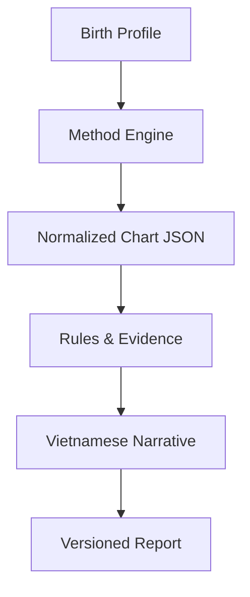

# 06 — Technical Architecture

## 1. System principle

Tách hoàn toàn **tính lá số**, **chọn bằng chứng** và **viết diễn giải**. Đây là điều kiện để sản phẩm có thể kiểm thử, giải thích, version và mở rộng nhiều hệ.

## 2. Bounded contexts

- Identity & Consent
- Birth Profiles
- Calculation Engines
- Chart Store
- Knowledge & Evidence
- Report Generation
- Commerce & Entitlements
- CMS & SEO
- Notifications
- Analytics & Experimentation
- Admin & Support

## 3. Canonical entities

### BirthProfile

- `id`, `owner_id`, `display_name`
- `calendar_input`, `birth_date`, `birth_time`, `time_precision`
- `place_id`, `lat`, `lon`, `timezone`
- `method_required_attributes`
- `consent_scope`, `created_at`, `deleted_at`

### Chart

- `id`, `profile_id`, `method`
- `engine_name`, `engine_version`, `rule_set`
- `normalized_input`
- `chart_json`
- `calculated_at`
- `input_hash`

### EvidenceItem

- `key`, `method`, `rule_version`
- `source_reference`
- `conditions`
- `interpretation_bounds`
- `risk_tags`

### Report

- `id`, `chart_id`, `sku`, `status`
- `evidence_keys`
- `content_json`, `rendered_html`, `pdf_asset`
- `prompt_version`, `model_id`, `knowledge_version`
- `created_at`, `supersedes_report_id`

### Order/Entitlement

- `order_id`, `user_id`, `sku`, `amount_vnd`, `payment_status`
- `provider_ref`, `idempotency_key`
- `entitlement_status`, `report_id`

## 4. Engine strategy

### Tử Vi

- Primary candidate: `SylarLong/iztro` — MIT, TypeScript/npm, chuyên Tử Vi.
- Integration/cross-check: `Brhiza/mingyu` — MIT, TypeScript, coverage rộng.
- Fixture cross-check: `tianji` — MIT/Python theo workbook nguồn.

### Bát Tự

- Primary candidate: `Brhiza/mingyu` — MIT.
- Cross-check: `tianji` hoặc nguồn độc lập được xác minh.

### Kinh Dịch

- Primary candidate: module MIT của `mingyu`.
- Cross-check methodology với các repo/reference đã ghi trong workbook coverage.

### Western natal

Nhu cầu search cao nhưng license là decision gate. Không nhúng code AGPL (`kerykeion`) vào closed product nếu chưa có quyết định compliance. Chọn một trong:

- engine/ephemeris có license thương mại phù hợp;
- dịch vụ có hợp đồng sử dụng;
- tự xây layer tính toán trên nguồn ephemeris được cấp phép.

## 5. License policy

- MIT/BSD/Apache: được ưu tiên, vẫn giữ notice và attribution theo license.
- GPL/AGPL: reference-only trong MVP proprietary trừ khi legal/compliance phê duyệt kiến trúc và nghĩa vụ source.
- Remote API/MCP: không coi là foundation nếu SLA, data processing và quyền thương mại chưa rõ.
- Mỗi dependency phải có: owner, version pin, license, SBOM, security scan và replacement plan.

## 6. Versioning & reproducibility

Mọi report phải tái tạo được về mặt provenance:

- input/timezone/calendar conversion version;
- engine + checksum;
- method/rule set;
- Chart JSON schema version;
- evidence set version;
- prompt/template/model;
- locale;
- render version.

Report cũ immutable. Khi sửa lỗi tính toán, tạo report mới và liên kết `supersedes`.

## 7. Reliability

- Calculation API idempotent theo `input_hash + method + engine_version`.
- Queue report generation; retry có backoff; không double-charge.
- Webhook payment idempotent.
- Cache chart calculation, không cache private rendered report công khai.
- Observability: trace từ order → chart → evidence → report.
- Dead-letter queue cho report lỗi; admin có regeneration action.

## 8. Privacy/security

- Dữ liệu sinh được xem là dữ liệu cá nhân; mã hóa in transit/at rest.
- Tách PII khỏi chart/evidence khi có thể.
- Signed URLs thời hạn ngắn cho PDF.
- Không log full report/PII vào analytics.
- Access control theo owner/explicit share token.
- Data retention và deletion workflow được công bố.
- Ảnh khuôn mặt/bàn tay không thu thập ở Phase 1.

## 9. Suggested deployment topology

- `www/lasoviet.vn`: SSR web + app shell.
- `api.lasoviet.vn`: API public/authenticated.
- Worker/queue private network.
- Object storage private cho PDF/chart artifacts.
- Managed relational DB cho user/order/version metadata.
- CMS tách quyền biên tập.

Không cần dùng `lasoviet.cloud` chỉ vì đã sở hữu; subdomain của `.vn` thường đơn giản và nhất quán hơn. `.cloud` chỉ có vai trò khi tách hạ tầng tạo lợi ích vận hành thật.
