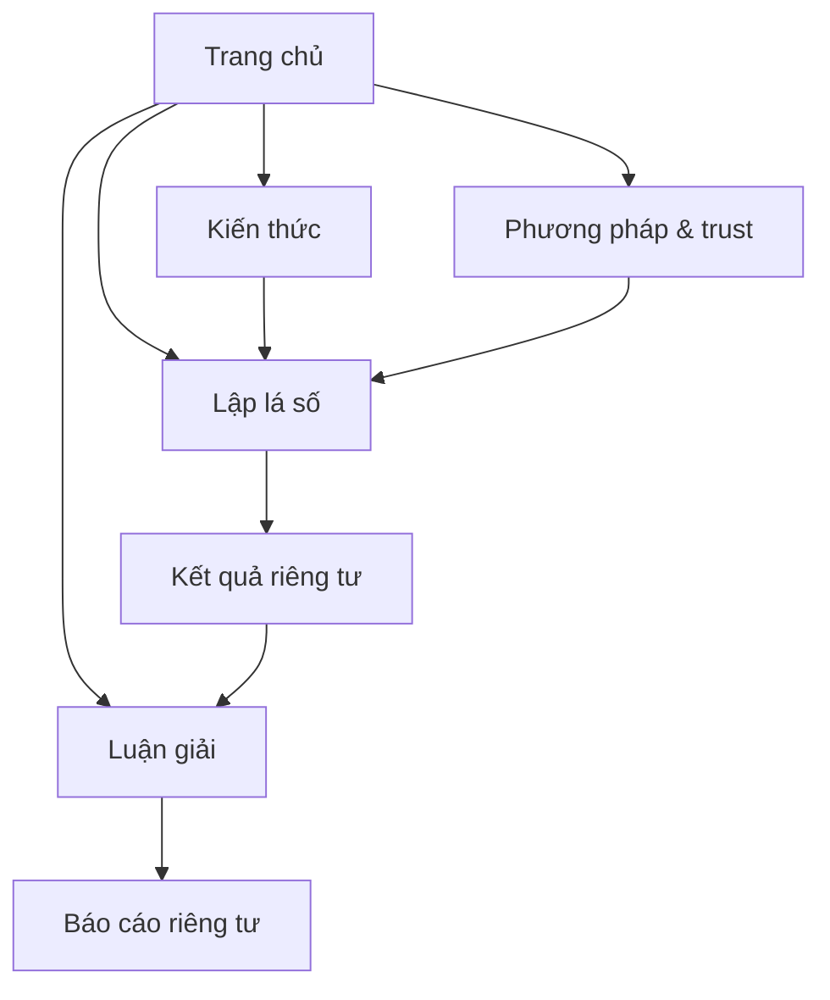
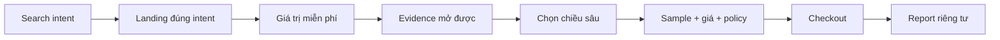
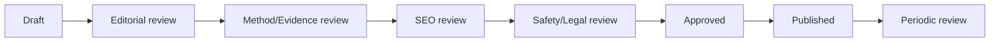

# Lá Số Việt — Sitemap, SEO & Wireframe Blueprint v1.2

> Navigation and discipline URLs: `docs/19`. Page layouts: the FD-091 spec. Index eligibility: `docs/23`. This file keeps route registry, SEO templates, structured data, and technical SEO.

> **Mục tiêu:** tạo một kiến trúc website có khả năng cạnh tranh nhóm đầu tìm kiếm tại Việt Nam, dễ vận hành dài hạn, thân thiện với người dùng và thể hiện đúng định vị “thư viện tri thức Việt đương đại”.

## 0. Kết luận điều hành

Không sitemap, agency hay kỹ thuật nào có thể **đảm bảo** vị trí số 1. Google cũng không bảo đảm crawl, index hoặc thứ hạng chỉ vì một website tuân thủ hướng dẫn. Vì vậy, hợp đồng thành công đúng phải là:

1. Google hiểu đúng cấu trúc, intent và entity của website.
2. Mỗi nhu cầu tìm kiếm có đúng một URL chịu trách nhiệm; không tự cạnh tranh từ khóa.
3. Trải nghiệm calculator và nội dung tạo giá trị độc lập tốt hơn mặt bằng hiện tại.
4. Niềm tin, phương pháp, nguồn và privacy là một phần của sản phẩm — không phải trang pháp lý bị giấu ở footer.
5. Đội ngũ có thể xuất bản, review, đo lường và bảo trì nội dung mà không làm sitemap vỡ dần theo thời gian.

### Ba intent phải sở hữu trước

1. **Lập lá số Tử Vi** — công cụ miễn phí, nhanh, chính xác theo rule set công bố.
2. **Luận giải lá số Tử Vi** — chiều sâu trả phí có sample, giá và căn cứ rõ.
3. **Hiểu và đọc lá số Tử Vi** — thư viện tri thức dễ tiếp cận, liên kết trực tiếp với chart.

Đây là **thứ tự đầu tư**, không phải giới hạn của sitemap. Kiến trúc phải chứa đầy đủ các hệ Đông–Tây ngay từ đầu để URL, taxonomy, CMS và data model không phải đập lại khi P1 bắt đầu. Chỉ khác nhau ở trạng thái phát hành và index.

---

# 1. North Star kiến trúc

## 1.1 Concept không gian

Website gồm hai không gian tách biệt nhưng liên tục về trải nghiệm:

| Không gian | Vai trò | Indexing | Mood |
|---|---|---|---|
| **Thư viện công khai** | Landing, kiến thức, phương pháp, nguồn, sample report và thương hiệu | Public, indexable | Ấn bản tri thức sáng, tĩnh, có cấu trúc |
| **Bàn đọc riêng tư** | Form dữ liệu sinh, lá số cá nhân, checkout, report và tài khoản | Private, access-controlled, `noindex` | Tập trung, an toàn, ít phân tâm |

## 1.2 Bảy nguyên tắc quyết định

1. **Một trang — một nhiệm vụ chính.**
2. **Một intent — một canonical URL.**
3. **Giá trị trước tài khoản.** Người dùng được lập và xem kết quả miễn phí trước khi lưu hoặc mua.
4. **Evidence tại thời điểm nghi ngờ.** Nút “Vì sao có nhận định này?” nằm cạnh claim.
5. **Uncertainty phải nhìn thấy.** Không rõ giờ sinh, timezone hoặc giới hạn phương pháp không bị xử lý âm thầm.
6. **Public content được render từ server; private data không đi vào index.**
7. **Doanh thu thắng khi hợp pháp (FD-064); privacy, payment integrity và nội dung khoá luôn giữ.**

---

# 2. Navigation

Public header and menus: `docs/19` §1. The main nav does not include daily tools; they live in `/cong-cu-mien-phi` (FD-094).

## 2.3 Private product navigation

- Wizard và checkout dùng local navigation, loại toàn bộ menu gây phân tâm.
- Result/report: logo, trạng thái riêng tư/lưu, Trợ giúp và tài khoản.
- Mobile authenticated có tối đa bốn mục: **Lá số — Báo cáo — Kiến thức — Tài khoản**.

---

# 3. Sitemap canonical

## 3.1 Bản đồ tổng thể



## 3.2 P0 route registry — public routes and reserved commercial candidates

### Trang chủ và sản phẩm

| URL | Intent chính | Primary CTA | Owner |
|---|---|---|---|
| `/` | Brand + bắt đầu | Lập lá số miễn phí | Brand/Product |
| `/la-so-tu-vi` | Calculator: lá số/lập lá số/miễn phí | Bắt đầu form | Product/Method |
| `/luan-giai-tu-vi` | Commercial hub | Xem sample/chọn chủ đề | Product/Growth |
| `/luan-giai-tu-vi/tong-quan-ban-menh` | First paid commercial topic | Chọn lá số | Product/Content |
| `/luan-giai-tu-vi/tinh-duyen-hon-nhan` | Reserved commercial topic | Chưa public | Product/Content |
| `/luan-giai-tu-vi/cong-viec-tai-loc` | Reserved commercial topic | Chưa public | Product/Content |
| `/luan-giai-tu-vi/van-trinh-{year}` | Reserved seasonal topic | Chưa public | Product/Content |
| `/bao-cao-mau/tu-vi` | Proof trước mua | Dùng lá số của tôi | Content/Product |

### Kiến thức nền tảng

| URL | Intent |
|---|---|
| `/kien-thuc` | Knowledge root |
| `/kien-thuc/tu-vi` | Tử Vi pillar hub |
| `/kien-thuc/tu-vi/la-so-tu-vi-la-gi` | Định nghĩa và cấu trúc |
| `/kien-thuc/tu-vi/cach-lap-la-so-tu-vi` | Quy trình lập lá số |
| `/kien-thuc/tu-vi/cach-doc-la-so-tu-vi` | Hướng dẫn đọc |
| `/kien-thuc/tu-vi/12-cung-trong-la-so-tu-vi` | Hub 12 cung |
| `/kien-thuc/tu-vi/14-chinh-tinh` | Hub chính tinh |
| `/kien-thuc/tu-vi/menh-than-cuc` | Thuật ngữ nền |
| `/kien-thuc/tu-vi/dai-van-tieu-van` | Chu kỳ/vận trình |
| `/kien-thuc/tu-vi/gio-sinh-anh-huong-the-nao` | Missing-time intent |
| `/kien-thuc/tu-vi/tu-vi-co-chinh-xac-khong` | Trust/accuracy intent |
| `/kien-thuc/tu-vi/cac-truong-phai-tu-vi` | Method differences |

### Phương pháp, trust và thương hiệu

| URL | Vai trò |
|---|---|
| `/phuong-phap` | Hub giải thích cách hệ thống hoạt động |
| `/phuong-phap/tu-vi` | Rule set, engine, input, version và giới hạn |
| `/phuong-phap/ai-va-can-cu` | Engine–evidence–AI disclosure |
| `/nguon-tri-thuc` | Source registry và cách chọn nguồn |
| `/ve-la-so-viet` | Brand, pháp nhân, đội ngũ và trách nhiệm |
| `/cau-hoi-thuong-gap` | FAQ cho người dùng; không kỳ vọng rich result |
| `/lien-he` | Hỗ trợ/liên hệ |
| `/chinh-sach-bao-mat` | Chính sách dữ liệu duy nhất |
| `/dieu-khoan` | Terms, commerce và limitation |

**Quyết định hợp nhất:** bỏ việc để `/bao-mat-du-lieu` và `/chinh-sach-bao-mat` cạnh tranh cùng intent. Nếu URL cũ đã live, redirect 301 về `/chinh-sach-bao-mat`.

## 3.3 Private/noindex

| URL | Chức năng | Bảo vệ |
|---|---|---|
| `/tao-la-so/tu-vi` | Wizard dữ liệu sinh | Guest được phép; `noindex` |
| `/la-so/{opaque_id}` | Chart + free insight | Private, ID không tuần tự |
| `/la-so/{opaque_id}/chon-luan-giai` | Chọn topic | Private |
| `/thanh-toan/{order_id}` | Checkout và trạng thái | Private, idempotent |
| `/bao-cao/{opaque_id}` | Report reader | Auth/share grant, `noindex` |
| `/tai-khoan` | Dashboard | Auth, `noindex` |
| `/tai-khoan/ho-so-sinh` | Birth profiles | Auth |
| `/tai-khoan/bao-cao` | Reports đã mua | Auth |
| `/tai-khoan/don-hang` | Order/support | Auth |
| `/tai-khoan/quyen-rieng-tu` | Consent/export/delete | Auth |

`noindex` không phải cơ chế bảo mật. Private route vẫn phải có authentication hoặc signed grant, URL không đoán được và access control ở server.

## 3.4 Kiến trúc đầy đủ Đông–Tây

### 3.4.1 Hub khám phá hệ quy chiếu

| URL | Vai trò | Index policy |
|---|---|---|
| `/he-quy-chieu` | Giải thích toàn bộ hệ Đông–Tây, khác biệt input/output và trạng thái sẵn sàng | Chỉ index khi có nội dung so sánh thật; nếu chỉ là roadmap thì `noindex` |
| `/he-quy-chieu/dong-phuong` | Nhóm Tử Vi, Bát Tự, Kinh Dịch | Collection page khi tối thiểu hai hệ có nội dung thật |
| `/he-quy-chieu/tay-phuong` | Nhóm Bản đồ sao, Horoscope, Thần số học, Tarot | Collection page khi tối thiểu hai hệ có nội dung thật |

Hub này phục vụ định vị “một người, nhiều hệ quy chiếu”; không thay thế các landing SEO theo tên từng bộ môn.

### 3.4.2 Đông phương

| Bộ môn | Calculator/tool | Commercial | Knowledge hub | Phase |
|---|---|---|---|---|
| **Tử Vi Đẩu Số** | `/la-so-tu-vi` | `/luan-giai-tu-vi/**` | `/kien-thuc/tu-vi/**` | P0 — live đầu tiên |
| **Bát Tự / Tứ Trụ** | `/la-so-bat-tu` | `/luan-giai-bat-tu` | `/kien-thuc/bat-tu/**` | P1 — engine/evidence gate |
| **Kinh Dịch** | `/gieo-que-kinh-dich` | `/luan-giai-kinh-dich` | `/kien-thuc/kinh-dich/**` | P1 — input theo câu hỏi, không dùng birth profile |

Knowledge cluster Bát Tự dự kiến:

- `/kien-thuc/bat-tu/bat-tu-la-gi`
- `/kien-thuc/bat-tu/cach-lap-la-so-bat-tu`
- `/kien-thuc/bat-tu/thien-can-dia-chi`
- `/kien-thuc/bat-tu/ngu-hanh-va-nhat-chu`
- `/kien-thuc/bat-tu/thap-than`
- `/kien-thuc/bat-tu/dai-van`

Knowledge cluster Kinh Dịch dự kiến:

- `/kien-thuc/kinh-dich/kinh-dich-la-gi`
- `/kien-thuc/kinh-dich/cach-dat-cau-hoi`
- `/kien-thuc/kinh-dich/que-chu-que-bien`
- `/kien-thuc/kinh-dich/hao-dong`
- `/kien-thuc/kinh-dich/vi-sao-khong-nen-gieo-que-lap-lai`

### 3.4.3 Tây phương

| Bộ môn | Calculator/tool | Commercial | Knowledge hub | Phase |
|---|---|---|---|---|
| **Bản đồ sao / Western Natal** | `/ban-do-sao` | `/luan-giai-ban-do-sao` | `/kien-thuc/chiem-tinh/**` | P1 — license/ephemeris gate |
| **Horoscope / Cung hoàng đạo** | `/cung-hoang-dao`; `/du-bao-cung-hoang-dao` | Chưa bán riêng ở P1 | `/kien-thuc/chiem-tinh/cung-hoang-dao/**` | P1 content/utility |
| **Thần số học** | `/than-so-hoc` | `/luan-giai-than-so-hoc` chỉ sau WTP gate | `/kien-thuc/than-so-hoc/**` | P1 acquisition, có thể build sớm |
| **Tarot / Bói bài** | `/boi-bai/tarot` dưới hub `/boi-bai` | Chưa commercial ở P1 | `/kien-thuc/tarot/**` | P1 free tool/content |

#### Chiêm tinh Tây phương: tách ba intent

1. `/ban-do-sao` — calculator cá nhân từ ngày, giờ và nơi sinh.
2. `/cung-hoang-dao` — hub evergreen về 12 cung.
3. `/du-bao-cung-hoang-dao` — Horoscope theo thời gian, chỉ mở khi có ephemeris, methodology và lịch biên tập thật.

Không tạo đồng thời `/horoscope` và `/du-bao-cung-hoang-dao` như hai trang indexable cùng intent. Nếu cần URL tiếng Anh cho campaign, `/horoscope` redirect 301 về canonical tiếng Việt.

Knowledge cluster Chiêm tinh dự kiến:

- `/kien-thuc/chiem-tinh/ban-do-sao-la-gi`
- `/kien-thuc/chiem-tinh/cach-lap-ban-do-sao`
- `/kien-thuc/chiem-tinh/mat-troi-mat-trang-cung-moc`
- `/kien-thuc/chiem-tinh/12-cung-hoang-dao`
- `/kien-thuc/chiem-tinh/12-nha`
- `/kien-thuc/chiem-tinh/cac-hanh-tinh`
- `/kien-thuc/chiem-tinh/goc-chieu`
- `/kien-thuc/chiem-tinh/gio-sinh-va-cung-moc`

Entity pages 12 cung đặt dưới `/kien-thuc/chiem-tinh/cung-hoang-dao/{slug}`, ví dụ `/bach-duong`, `/kim-nguu`. Chỉ index khi mỗi trang có nội dung độc lập; không nhân bản template đổi tên cung.

#### Horoscope không được biến thành content farm

- Một calculator `/du-bao-cung-hoang-dao` cho chọn cung và khoảng thời gian tốt hơn 12 × 365 URL mỏng.
- Chỉ tạo archive theo tháng/năm nếu có dữ liệu thiên văn, biên tập và nhu cầu độc lập.
- Không dùng câu tuyệt đối, cảnh báo xấu hoặc notification gây lo âu.
- Daily/weekly content không được viết hàng loạt chỉ bằng AI.

Knowledge cluster Thần số học dự kiến:

- `/kien-thuc/than-so-hoc/than-so-hoc-la-gi`
- `/kien-thuc/than-so-hoc/cach-tinh-so-chu-dao`
- `/kien-thuc/than-so-hoc/chi-so-duong-doi`
- `/kien-thuc/than-so-hoc/chi-so-linh-hon`
- `/kien-thuc/than-so-hoc/chi-so-su-menh`
- `/kien-thuc/than-so-hoc/nam-ca-nhan`
- `/kien-thuc/than-so-hoc/pitago-va-cac-truong-phai`

Knowledge cluster Tarot dự kiến:

- `/kien-thuc/tarot/tarot-la-gi`
- `/kien-thuc/tarot/bo-bai-78-la`
- `/kien-thuc/tarot/major-arcana`
- `/kien-thuc/tarot/minor-arcana`
- `/kien-thuc/tarot/cach-dat-cau-hoi`
- `/kien-thuc/tarot/gioi-han-cua-viec-rut-bai-lap-lai`

### 3.4.4 Tiện ích văn hóa Việt Nam

| Bộ môn/utility | Route | Vai trò |
|---|---|---|
| 12 con giáp | `/12-con-giap` | Seasonal acquisition, liên kết Tử Vi |
| Lịch âm | `/lich-am` | Utility có nhu cầu lặp lại |
| Ngày tốt | `/ngay-tot` | Chọn loại việc + khoảng thời gian, có lý do |
| Phong thủy tính toán | `/phong-thuy/huong-nha` | Calculator miễn phí, không bán vật phẩm |
| Kiến thức phong thủy | `/kien-thuc/phong-thuy/**` | Content-only |
| Giải mã giấc mơ | `/giai-ma-giac-mo` | Content biểu tượng/dân gian; cấm liên hệ lô đề |

### 3.4.5 Cross-method pages

| URL | Điều kiện mở index |
|---|---|
| `/so-sanh/tu-vi-va-bat-tu` | Hai methodology đã được review |
| `/so-sanh/tu-vi-va-ban-do-sao` | Bản đồ sao đã live và license rõ |
| `/so-sanh/tu-vi-va-than-so-hoc` | Calculator Thần số học đã live |
| `/so-sanh/ban-do-sao-va-than-so-hoc` | Có ví dụ và intent độc lập |

Comparison page dùng để giáo dục, không tuyên bố hệ nào “đúng hơn”. Không index comparison khi một trong hai hệ chỉ là roadmap.

### 3.4.6 Trạng thái route

Mọi route ở trên được khai báo ngay trong Route Registry nhưng có một trong năm trạng thái:

| Status | Hành vi |
|---|---|
| `reserved` | Giữ taxonomy/ownership trong config; chưa deploy public URL |
| `preview_noindex` | QA/staging có auth hoặc `noindex`; không xuất hiện trong menu/sitemap |
| `live_noindex` | Tool thử nghiệm có thể dùng nhưng chưa đủ quality gate |
| `live_indexable` | Public, canonical, sitemap và navigation |
| `archived` | Retired route with an explicit 301, 404, or 410 disposition |

Như vậy sitemap sản phẩm là đầy đủ ngay từ đầu, nhưng Google và người dùng chỉ thấy những gì đã đủ chất lượng.

## 3.5 Entity pages sau launch

Mở dần 12 cung và 14 chính tinh tại `/kien-thuc/tu-vi/{entity}` khi mỗi trang có:

- intent độc lập;
- giải thích riêng, không thay tên trên template;
- ví dụ hoặc chart minh họa;
- phạm vi/giới hạn;
- liên kết hai chiều với tooltip trên chart;
- method reviewer và ngày review.

P0 nên có khoảng **25–35 URL indexable thật tốt**, không phải hàng trăm URL mỏng.

---

# 4. Keyword và intent architecture

| Cluster | Owner URL | Bao phủ | Không tạo thêm |
|---|---|---|---|
| Calculator Tử Vi | `/la-so-tu-vi` | lá số tử vi; lập/xem lá số; online; miễn phí | `/lap-la-so-tu-vi-mien-phi` |
| Commercial | `/luan-giai-tu-vi` | luận giải tử vi; luận giải lá số chuyên sâu | landing calculator thứ hai |
| Bản mệnh | `/luan-giai-tu-vi/tong-quan-ban-menh` | bản mệnh, tiềm năng | nhiều URL theo synonym |
| Tình cảm | `/luan-giai-tu-vi/tinh-duyen-hon-nhan` | tình duyên, hôn nhân | trộn với bài “cung Phu Thê” |
| Công việc | `/luan-giai-tu-vi/cong-viec-tai-loc` | công việc, sự nghiệp, tài lộc | nội dung đầu tư cụ thể |
| Vận năm | `/luan-giai-tu-vi/van-trinh-2027` | vận trình 2027 | tổ hợp tuổi × giới × năm |
| Định nghĩa | `/kien-thuc/tu-vi/la-so-tu-vi-la-gi` | lá số là gì | bài định nghĩa trùng lặp |
| Cách lập | `/kien-thuc/tu-vi/cach-lap-la-so-tu-vi` | cách lập | cạnh tranh với calculator |
| Cách đọc | `/kien-thuc/tu-vi/cach-doc-la-so-tu-vi` | cách đọc/xem | bài hướng dẫn rời rạc |
| Giờ sinh | `/kien-thuc/tu-vi/gio-sinh-anh-huong-the-nao` | không nhớ/sai giờ sinh | nhiều FAQ page mỏng |
| Trust | `/kien-thuc/tu-vi/tu-vi-co-chinh-xac-khong` | độ chính xác, giới hạn | tuyên bố khoa học/99% |

Biến thể keyword được xử lý bằng title, heading, copy, anchor và FAQ — không phải mỗi biến thể là một trang.

---

# 5. Conversion và internal-link graph



## 5.1 Link bắt buộc

- Homepage → calculator, commercial hub, methodology và Tử Vi hub.
- Knowledge hub → mọi pillar/entity page và calculator.
- Mỗi knowledge article → parent hub, calculator đúng method và 2–4 bài liên quan.
- Entity page → vị trí tương ứng trên chart hoặc guide “cách đọc”.
- Calculator → methodology, nguồn, giờ sinh và glossary liên quan.
- Free result → topic phù hợp chỉ sau khi đã giao small win.
- Commercial page → sample report, methodology, privacy/refund và calculator.
- Sample report → commercial page và methodology.
- Private report không tham gia public SEO link graph.

## 5.2 Quy tắc link

- Navigation dùng `<a href>` thật; không dùng JS-only button để đổi route.
- Anchor tự mô tả: “cách đọc lá số Tử Vi”, không lạm dụng “xem thêm”.
- Related content dựa trên entity/intent, không random.
- Footer không nhồi exact-match keyword.
- Không ép mọi bài kiến thức đi thẳng checkout.

---

# 6–7. Wireframes and design system

Removed on 2026-09-22 (FD-096). Page layouts, components, and type scale now come only from
`docs/superpowers/specs/2026-09-13-aituvi-ui-adaptation-for-lasoviet.md` (FD-091) and the
2026-09-22 revamp plan; colour and imagery from `docs/22` and `docs/24`.

---

# 8. SEO page templates

## 8.1 Calculator landing template

1. Title/H1 đúng method.
2. Form hoặc CTA ở phần đầu.
3. Sample chart/output thật.
4. Free deliverable và paid depth tách rõ.
5. Dữ liệu cần nhập và lý do.
6. Method, rule set, giới hạn.
7. FAQ từ query/support thật.
8. Internal links theo cluster.
9. Schema đúng nội dung hiển thị.

## 8.2 Knowledge article template

- Search intent và parent hub bắt buộc.
- Author + method reviewer thật.
- Source/evidence references.
- Plain-language summary.
- Figure/example độc lập.
- Limitations/risk tags.
- Contextual link sang calculator và 2–4 related pages.
- `lastReviewed`, không thay `dateModified` bằng automation giả freshness.

## 8.3 Commercial page template

- Job/pain point cụ thể.
- Sample thật, không testimonial giả.
- Deliverable/inclusion/exclusion.
- Giá VND, one-time/renewal status.
- ETA, regeneration/refund/support.
- Methodology và privacy gần CTA.
- Product/Offer data đồng nhất checkout.

---

# 9. Structured data

JSON-LD được sinh từ content model và route registry, không để editor viết tay.

| Page | Schema chính |
|---|---|
| Homepage | `Organization`, `WebSite` |
| About/author | `AboutPage`, `Organization`, `ProfilePage`/`Person` khi thật |
| Calculator | `WebApplication` hoặc `SoftwareApplication`, `BreadcrumbList` |
| Article | `Article`, `BreadcrumbList` |
| Hub | `CollectionPage`, `ItemList`, `BreadcrumbList` |
| Methodology | `TechArticle`/`Article`, `BreadcrumbList` |
| Glossary | `DefinedTerm`, `WebPage`, `BreadcrumbList` |
| Commercial report | `Product`, `Offer` bằng VND, `BreadcrumbList` |
| Sample report | `Article`/`CreativeWork` |

Không dùng `Review`/`AggregateRating` giả, `Person` giả hoặc markup nội dung bị ẩn. FAQ vẫn hữu ích cho người dùng, nhưng không triển khai chỉ để kỳ vọng chiếm SERP.

---

# 10. CMS và dữ liệu để dễ quản lý

## 10.1 Route Registry — nguồn chuẩn duy nhất

Tạo `config/route-registry.yml` được version bằng Git:

```yaml
id: calculator.tu-vi
path: /la-so-tu-vi
intent: calculator
template: calculator-landing
discipline: tu-vi
indexing: index_follow
canonical: self
schema_types:
  - WebApplication
  - BreadcrumbList
owner: product
cms_source: tool_landing
priority: p0
status: live_indexable
```

Registry sinh hoặc kiểm tra:

- navigation và breadcrumb;
- XML sitemap;
- canonical/robots;
- structured data template;
- redirect map;
- orphan links;
- route collision/cannibalization;
- canonical status
  `reserved / preview_noindex / live_noindex / live_indexable / archived`.

## 10.2 Content types

| Type | Dùng cho |
|---|---|
| `Discipline` | Tử Vi, Bát Tự, Kinh Dịch… |
| `ToolLanding` | Public calculator landing |
| `KnowledgeHub` | Pillar/collection page |
| `KnowledgeArticle` | Guide/explainer |
| `GlossaryTerm` | Tooltip + entity page |
| `MethodologyPage` | Method/rule/limits |
| `SourceReference` | Nguồn, edition, reliability tier |
| `FAQEntry` | FAQ reusable theo scope |
| `CommercialPage` | Product/SKU landing |
| `SampleReport` | Sample đã ẩn danh |
| `AuthorProfile` | Author/reviewer thật |
| `Redirect` | 301/retirement registry |
| `SeoMetadata` | Title, description, canonical và robots có kiểm soát |
| `ReusableBlock` | Disclosure, trust strip, privacy notice |

## 10.3 Taxonomy có kiểm soát

- `discipline`
- `search_intent`
- `life_area`
- `concept/entity`
- `content_format`
- `expertise_level`
- `risk_tag`
- `content_status`
- `evidence_tier`

Taxonomy dùng ID bất biến. Editor không tự tạo các tag đồng nghĩa như “tình yêu”, “tình cảm”, “tình duyên” nếu taxonomy owner chưa duyệt.

## 10.4 Workflow



Four-eyes review bắt buộc cho methodology, commercial claims, evidence và content có risk tag.

---

# 11. Engine, evidence và AI boundaries

| Lớp | Được làm | Không được làm |
|---|---|---|
| Engine | Chuẩn hóa input, lịch/timezone, tính chart deterministic | Viết luận giải hoặc gọi LLM |
| Rule/Evidence | Chọn evidence key theo rule version | Sáng tác conclusion ngoài rule |
| AI/Narrative | Viết tiếng Việt từ evidence allowlist | Tự tính chart/thêm sao/cung |
| Safety validator | Chặn thiếu evidence, mâu thuẫn, claim nguy hiểm | Tự thay quyết định chuyên môn |
| Renderer | HTML/PDF từ content JSON bất biến | Gọi AI mỗi lần mở report |

Mỗi report lưu provenance: input schema, calendar/timezone version, engine/checksum, rule set, chart schema, evidence set, prompt/model, safety policy, locale và renderer version.

---

# 12. Technical SEO

## 12.1 Rendering

- SSG/ISR hoặc SSR cho public HTML, H1, content và links.
- Calculator form có HTML server-rendered; engine/chart hydrate khi cần.
- Không dynamic rendering riêng cho bot.
- Chart có text alternative/HTML summary.
- Public retired route trả 301/404/410 đúng nghĩa; cấm soft 404.

## 12.2 Index control

- Account, checkout, thanh toán, private chart/report: `noindex` + access control.
- Private PDF: `X-Robots-Tag: noindex, noarchive`.
- On-site search, filter, sort, tracking params: noindex hoặc không tạo crawlable URL.
- Không chặn bằng robots.txt trang mà bot cần đọc `noindex`.
- Chặn `/api/`, `/admin/` và infinite URL spaces.

## 12.3 XML sitemap

- `/sitemap.xml` — sitemap index.
- `/sitemaps/pages.xml`
- `/sitemaps/tools.xml`
- `/sitemaps/knowledge-tu-vi.xml`
- thêm sitemap theo method khi cluster đủ lớn.

Chỉ chứa canonical URL trả 200 và indexable. `lastmod` chỉ đổi khi content thay đổi đáng kể.

## 12.4 Performance budget

Mục tiêu p75 mobile thực:

- LCP ≤2.5s
- INP ≤200ms
- CLS ≤0.1
- TTFB public target ≤800ms
- Initial JS public landing target ≤150KB gzip

Không tải chart engine, chart library hoặc payment SDK trong initial bundle. Font WOFF2 subset tiếng Việt, ảnh AVIF/WebP có kích thước, reserve chart dimensions và đo RUM theo route/device.

---

# 13. Programmatic SEO guardrails

Không index:

- kết quả theo từng ngày/giờ sinh;
- tổ hợp `năm × giới × cung × chủ đề`;
- public URL chứa PII;
- entity page chỉ thay tên;
- tag có 1–2 bài;
- search results;

A page is indexable when it returns real results or real content (`docs/23`).

---

# 14. Analytics và KPI

## 14.1 Event funnel

The ordered canonical funnel is versioned in `config/analytics-events.json`.
This document illustrates that contract but does not define a second event
order.

Không gửi tên, ngày/giờ/nơi sinh, chart JSON, report text, email hoặc payment reference sang analytics.

## 14.2 SEO health

| KPI | Operating target ban đầu |
|---|---|
| Priority URLs discovered sau 28 ngày | ≥90% |
| Priority URLs indexed | giả thuyết ≥80%; audit nếu <60% |
| Canonical conflict P0 | 0 |
| Structured-data critical errors | 0 |
| CWV | Pass cả 3 ở p75 theo template |
| Manual action/security issue | 0 |

## 14.3 Visibility và business

- Non-brand impressions/clicks theo cluster.
- Query-to-page map và cannibalization.
- Top 3/Top 10 là kết quả quan sát, không phải lời hứa.
- Organic → valid chart created.
- Evidence open rate.
- Chart → paid topic selected.
- Checkout completion và revenue/valid chart.
- Refund, regeneration, complaint và deletion guardrails.
