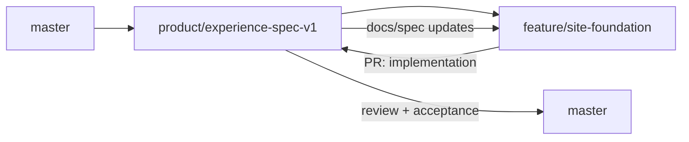

# Lá Số Việt — Quy trình branch giữa Product và Development

## 1. Vai trò

- **Product owner:** Harris — người chốt concept, brand, sitemap, UX và acceptance criteria.
- **Developer:** An — người triển khai code, test và sửa theo review.
- **Protected release branch:** `master` — chỉ nhận thay đổi đã được review và chấp nhận.

## 2. Hai branch làm việc

| Branch | Owner chính | Mục đích |
|---|---|---|
| `product/experience-spec-v1` | Harris/Product | Source of truth cho docs, decisions, acceptance criteria và nhánh integration trước release |
| `feature/site-foundation` | An/Development | Code implementation, test và các thay đổi kỹ thuật của website |

Không commit trực tiếp vào `master` trong quá trình làm việc.

## 3. Flow chuẩn



### Bước 1 — Product tạo nhánh tài liệu

Nhánh `product/experience-spec-v1` được tạo từ `master` và chứa:

- Brand & Experience Guideline;
- Sitemap, SEO & Wireframe Blueprint;
- decision log;
- acceptance criteria;
- mọi cập nhật scope đã được Product chốt.

### Bước 2 — An tạo branch code từ branch Product

```bash
git fetch origin
git switch -c feature/site-foundation origin/product/experience-spec-v1
git push -u origin feature/site-foundation
```

An code và commit chỉ trên `feature/site-foundation`.

### Bước 3 — Product tiếp tục cập nhật docs

Harris tiếp tục commit các thay đổi đã chốt vào:

```text
product/experience-spec-v1
```

Mỗi commit docs nên có một mục `Impact on implementation` nếu thay đổi ảnh hưởng code, data, route hoặc acceptance criteria.

### Bước 4 — An đồng bộ cập nhật từ Product

Trước khi bắt đầu một hạng mục mới, và trước khi mở PR:

```bash
git fetch origin
git switch feature/site-foundation
git merge origin/product/experience-spec-v1
```

An giải quyết conflict trên branch của An, chạy test và push lại:

```bash
git push origin feature/site-foundation
```

Không merge branch code vào `master` ở bước này.

### Bước 5 — An mở PR về branch Product

PR direction:

```text
feature/site-foundation → product/experience-spec-v1
```

PR phải có:

- phạm vi đã làm;
- screenshot desktop/mobile;
- route/page đã thêm hoặc đổi;
- tests đã chạy;
- accessibility, SEO và performance checks;
- known limitations;
- checklist acceptance criteria tương ứng.

Product review trên PR. Mọi yêu cầu sửa được An commit tiếp vào `feature/site-foundation`; PR tự cập nhật.

### Bước 6 — Merge implementation vào branch Product

Chỉ merge khi:

- acceptance criteria pass;
- không còn lỗi release-blocking;
- docs và implementation không mâu thuẫn;
- SEO/noindex/privacy/accessibility gates pass;
- Product approve.

Sau merge, `product/experience-spec-v1` là bản tích hợp gồm cả docs và code đã chấp nhận.

### Bước 7 — Product mở PR lên master

PR direction:

```text
product/experience-spec-v1 → master
```

Đây là release PR cuối. Không merge nếu CI, test, build hoặc release checklist chưa pass.

## 4. Quy tắc conflict và ownership

| Khu vực | Người quyết định cuối |
|---|---|
| Brand, copy, sitemap, user flow, acceptance criteria | Harris/Product |
| Implementation, framework, component internals, test strategy | An/Development |
| URL, data contract, privacy, analytics, accessibility | Product và Development cùng review |
| Conflict giữa conversion và trust/safety | Trust/safety thắng; Product chốt |

Nếu code cho thấy spec không khả thi hoặc tạo rủi ro kỹ thuật, An không tự thay đổi hành vi sản phẩm. An ghi rõ trade-off trên PR; hai bên cập nhật quyết định trong docs trước khi merge.

## 5. Commit convention

```text
docs: update homepage hierarchy
docs: clarify unknown birth time flow
feat: implement calculator landing
feat: add private chart result route
fix: prevent duplicate payment submission
test: add timezone and lunar conversion fixtures
refactor: separate evidence renderer from chart engine
```

Commit nên nhỏ, có một mục đích và không trộn docs thay đổi scope với refactor không liên quan.

## 6. Branch protection đề xuất

### `master`

- Cấm direct push.
- Bắt buộc pull request.
- Bắt buộc CI/build/test pass.
- Ít nhất một approval.
- Không force-push và không xóa branch.

### `product/experience-spec-v1`

- Harris có thể cập nhật docs trực tiếp.
- Code chỉ đi vào qua PR từ branch An.
- Không force-push sau khi An đã tạo branch làm việc.

### `feature/site-foundation`

- An sở hữu commit/code.
- Product không push code trực tiếp vào branch này.
- Nhận cập nhật spec bằng merge từ branch Product.

## 7. Definition of done trước khi lên master

- Đúng brand guideline và sitemap đã chốt.
- Desktop/mobile responsive.
- WCAG 2.2 AA release gate pass.
- Public route có canonical/schema/index policy đúng.
- Private route access-controlled và `noindex`.
- Không gửi PII vào analytics/log.
- Core Web Vitals budget không regression nghiêm trọng.
- Empty/loading/error/pending/success states đầy đủ.
- Product acceptance và Development test đều pass.
- Docs được cập nhật cùng implementation.
