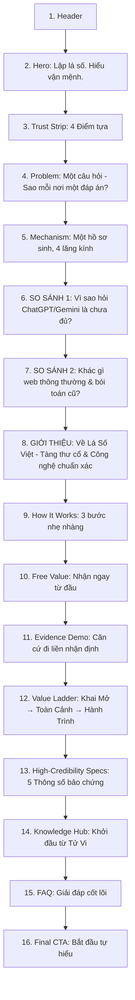

# Homepage Content Proposal — v5 (Concise, Visual & Scannable Copywriting)

**Status:** Proposal, updated per founder's instruction (2026-09-04). Pending founder ("Harris/Product") sign-off. Not yet applied to [homepage.html](./homepage.html).  
**Author:** AI Pair Programming (condensed copy, scannable formatting, visual bullet structures, zero fluff).  
**Date:** 2026-09-04  

---

## 1. Narrative Architecture (Bảo lưu trọn vẹn 16 khối)

---

## 2. Full Section Copy (Rút gọn, súc tích, trực quan)

---

### Block 1: Header
* **Logo:** Lá Số Việt
* **Menu:** Lập lá số Tử Vi · Các hệ quy chiếu · Thư viện tri thức · Về phương pháp
* **Nút hành động:** [Lập lá số miễn phí]

---

### Block 2: Hero Section

* **Eyebrow:** Một hồ sơ sinh · Đa tầng soi chiếu Đông – Tây
* **H1 (Canonical — Locked):**  
  # Lập lá số. Hiểu vận mệnh.
* **Supporting line:**  
  Nhập thời khắc sinh một lần — soi tỏ căn tính và đường đời qua Tử Vi, Bát Tự, Bản đồ sao và Thần Số Học.
* **Subhead:**  
  Không thần bí hóa, không phán xét tương lai. Lá Số Việt chuyển hóa đồ hình cổ xưa thành lời giải thích tiếng Việt sáng rõ, minh bạch từng căn cứ — để bạn thấu hiểu chính mình và vững vàng trong mọi lựa chọn.
* **CTA Group:**  
  * [Lập lá số miễn phí] *(Chính)*  
  * [Xem bản luận giải mẫu] *(Phụ)*
* **Microcopy:** *Miễn phí ngay lập tức · Riêng tư tuyệt đối · Không cần đăng ký tài khoản.*

---

### Block 3: Trust Strip

* **Bốn điểm tựa:**  
  **Miễn phí khởi đầu** · **Tường minh căn cứ** · **Riêng tư tuyệt đối** · **Không ép gia hạn**

---

### Block 4: Problem Recognition (Khi bạn đi tìm câu trả lời)

* **Eyebrow:** Khi bạn đi tìm câu trả lời
* **Tiêu đề:**  
  ## Một câu hỏi cho cuộc đời — Sao mỗi nơi một đáp án?
* **Body copy (Súc tích):**  
  Tra Tử Vi một nơi, xem Thần Số Học một chỗ, đọc thêm Bản Đồ Sao ở nơi khác. Mỗi nơi phán một mảnh ghép rời rạc, mâu thuẫn:
  * **Thuật ngữ đánh đố:** Quá nhiều từ Hán-Việt cổ, đọc xong càng thêm mơ hồ.
  * **Văn mẫu chung chung:** Khen chê chung chung kiểu áp cho ai cũng đúng.
  * **Dọa dẫm trục lợi:** Phóng đại vận hạn cốt để ép mua đồ giải hạn.
* **Cầu nối:**  
  *Lá Số Việt hợp nhất các hệ tri thức tinh hoa trên cùng tọa độ sinh của riêng bạn — giải nghĩa mạch lạc, tường minh căn cứ, để bạn tự đối chiếu và quyết định.*

---

### Block 5: Core Mechanism (Một hồ sơ sinh, nhiều lăng kính)

* **Eyebrow:** Hệ quy chiếu đa chiều
* **Tiêu đề:**  
  ## Một hồ sơ sinh duy nhất. Soi tỏ qua 4 lăng kính.
* **Đoạn dẫn:** Nhập ngày giờ sinh một lần. Hồ sơ của bạn được kích hoạt đồng thời qua 4 bộ môn nguyên bản — không pha trộn, không suy diễn gượng ép:
* **4 Cards bộ môn:**
  * **Tử Vi Đẩu Số — Tinh hoa Á Đông**  
    Đồ hình 12 cung và đại vận 10 năm. Thấu suốt gốc rễ bản mệnh, các nút thắt then chốt và thời điểm chuyển mình.  
    *[Xem lá số Tử Vi →]*
  * **Bát Tự / Tứ Trụ — Cân bằng ngũ hành**  
    Phân tích Kim – Mộc – Thủy – Hỏa – Thổ qua 4 trụ. Nhận diện điểm vượng - khuyết để thuận dòng tự nhiên, chọn thời lập nghiệp.  
    *[Khám phá Bát Tự →]*
  * **Bản Đồ Sao — Chiêm tinh phương Tây**  
    Tâm lý học chiều sâu qua vị trí các thiên thể. Giải mã cấu trúc tính cách, xung đột nội tâm và động lực vô thức.  
    *[Khám phá Bản đồ sao →]*
  * **Thần Số Học — Nhịp điệu đường đời**  
    Tần số sóng rung từ ngày sinh và tên gọi. Nhận diện bài học cần hoàn thiện và xu hướng biến chuyển từng năm.  
    *[Khám phá Thần số học →]*

---

### Block 6: AI Chatbot Comparison (Vì sao hỏi ChatGPT hay Gemini là chưa đủ?)

* **Eyebrow:** Một so sánh cần thiết
* **Tiêu đề:**  
  ## Vì sao chỉ hỏi ChatGPT hay Gemini là chưa đủ để hiểu lá số?
* **Bốn điểm khác biệt then chốt:**
  * **1. Chatbot hay gặp lỗi "ảo giác" khi tính toán thiên văn**  
    LLM chỉ là mô hình ngôn ngữ, không phải cỗ máy tính toán. Chúng rất hay đổi sai ngày âm dương, nhầm múi giờ lịch sử Việt Nam và an nhầm vị trí sao. Dữ liệu gốc sai thì lời giải vô nghĩa.
  * **2. Lá Số Việt sở hữu engine tính toán thiên văn chuẩn xác**  
    Thuật toán chuyên biệt mô phỏng chính xác từng tọa độ thiên thể, tiết khí và can chi trước khi đưa vào luận giải.
  * **3. Cổ thư kiểm chứng vs. Dữ liệu mạng hỗn tạp**  
    Chatbot gom nhặt thông tin trôi nổi lẫn lộn dị bản. Lá Số Việt chuẩn hóa dữ liệu theo kinh điển mệnh lý chính thống, loại bỏ mê tín.
  * **4. Đồ hình trực quan sinh động vs. Bức tường chữ vô hồn**  
    Tương tác trực tiếp trên thiên bàn 12 cung, tra cứu từng cung vị và lưu trữ hồ sơ an toàn thay vì đọc một đoạn chat dài rối rắm.

---

### Block 7: Category Comparison (Khác biệt so với web thông thường & bói toán cũ)

* **Eyebrow:** Góc nhìn đối chiếu
* **Tiêu đề:**  
  ## Lá Số Việt khác gì so với web tra cứu thông thường và bói toán cũ?

* **Bảng so sánh trực quan:**

| Tiêu chí | Các website tra cứu hiện nay | Bói toán truyền thống ngoài thị trường | Chuẩn mực tại Lá Số Việt |
| :--- | :--- | :--- | :--- |
| **Nguồn tri thức** | Sao chép trôi nổi từ diễn đàn, lẫn lộn dị bản. | Truyền khẩu một chiều, khó kiểm chứng. | **Kế thừa và chuẩn hóa từ 100+ tàng thư cổ Đông – Tây**. |
| **Ngôn ngữ** | Lạm dụng từ Hán – Việt đánh đố, dịch máy móc. | Phán xét áp đặt, dùng từ huyền bí tạo uy quyền. | **Tiếng Việt sáng rõ, hiện đại**, gắn liền thực tế đời sống. |
| **Tính căn cứ** | Nhận định chung chung, buông lời phán không lý do. | "Thầy nói sao nghe vậy", không giải thích nguyên do. | **Mở xem căn cứ tại chỗ**: Rõ từng sao, cung vị và quy tắc. |
| **Phạm vi** | Đơn lẻ từng bộ môn (chỉ xem riêng Tử Vi hoặc Thần số). | Phân mảnh; đổi bộ môn phải tìm thầy mới từ đầu. | **Một hồ sơ sinh duy nhất**: Đối chiếu đồng thời 4 bộ môn. |
| **Tâm lý tiếp nhận** | Chèn ép quảng cáo, giật tít câu view. | Dọa dẫm hạn xấu để gợi ý cúng bái, mua đồ giải hạn. | **Điềm tĩnh, tôn trọng**: Giúp bạn thấu hiểu quy luật để tự chủ. |
| **Bảo mật & Phí** | Rủi ro rò rỉ dữ liệu; phí phát sinh mập mờ. | Chi phí không rõ ràng, dễ đội giá tiền lễ. | **Riêng tư mặc định** (toàn quyền xóa); bảng giá minh bạch. |

---

### Block 8: About Lá Số Việt (Tinh hoa tàng thư cổ & Công nghệ chuẩn mực)

* **Eyebrow:** Về Lá Số Việt
* **Tiêu đề:**  
  ## Nơi tinh hoa tàng thư cổ gặp gỡ công nghệ tính toán chuẩn mực
* **Đoạn dẫn:** Lá Số Việt là công trình số hóa và chuẩn hóa tri thức mệnh lý Á Đông và chiêm tinh phương Tây thành một nền tảng sáng rõ, an toàn cho người Việt hiện đại.
* **Ba giá trị cốt lõi:**
  * **Số hóa từ 100+ bộ tàng thư kinh điển Đông – Tây**  
    Kế thừa các trước tác cổ điển (*Tử Vi Đẩu Số Toàn Thư, Tử Vi Đại Toàn, Uyên Hải Tử Bình, Tam Mệnh Thông Hội, Ptolemy Tetrabiblos, Pytago...*). Mọi luận điểm đều truy nguyên về cội nguồn học thuật.
  * **Hàng trăm giờ huấn luyện máy đọc chuyên sâu**  
    Hệ thống bóc tách các tầng ẩn dụ cổ ngữ, logic hóa thành các quy tắc kiểm chứng được, loại bỏ hoàn toàn suy diễn cảm tính và mê tín dị đoan.
  * **Cỗ máy tính toán thiên văn chuẩn xác từng phân giây**  
    Tách bạch thuật toán an sao với lớp diễn giải ngôn ngữ, đảm bảo dữ liệu tính toán chuẩn xác tuyệt đối trước khi chuyển dịch thành lời văn ấm áp.

---

### Block 9: How It Works (Ba bước chiêm nghiệm nhẹ nhàng)

* **Eyebrow:** Bắt đầu nhẹ nhàng
* **Tiêu đề:**  
  ## Ba bước sáng tỏ, không chút rào cản
* **Quy trình 3 bước:**
  1. **Nhập thời khắc sinh:** Cung cấp ngày, tháng, năm và giờ sinh. *(Chưa rõ giờ sinh? Vẫn có các tầng phân tích chuẩn xác theo ngày).*
  2. **Xem lá số & 3 nhận định miễn phí:** Khám phá đồ hình trực quan và 3 nhận định cốt lõi kèm toàn bộ căn cứ giải thích.
  3. **Chủ động mở rộng chiều sâu:** Khi cần lời giải cho một ngã rẽ cụ thể, chọn bản luận giải sâu. *(Luôn xem trước mục lục và bản mẫu trước khi quyết định).*

---

### Block 10: Upfront Free Value (Những gì nhận được ngay từ đầu)

* **Eyebrow:** Món quà khởi đầu
* **Tiêu đề:**  
  ## Trải nghiệm giá trị thật trước khi nghĩ đến chi phí
* **3 Giá trị sẵn sàng ngay sau khi lập lá số:**
  * **Đồ hình lá số chi tiết:** Vẽ chuẩn xác theo thiên văn và lịch pháp, giao diện thanh nhã, trực quan từng cung vị.
  * **Ba nhận định cốt lõi về bản mệnh:** Đúc kết sắc bén về bản chất tính cách, điểm tựa thế mạnh và thách thức lớn nhất.
  * **Một căn cứ luận giải mở công khai:** Minh chứng rõ ràng vì sao có nhận định đó trên tinh bàn của bạn.

---

### Block 11: Evidence Demo (Nhận định luôn đi cùng căn cứ)

* **Eyebrow:** Minh bạch trong từng chi tiết
* **Tiêu đề:**  
  ## Nhận định đi liền căn cứ. Không võ đoán, không giấu nghề.
* **Đoạn dẫn:** Tại Lá Số Việt, mọi phân tích đều có xuất xứ. Bên cạnh mỗi nhận định luôn có nút **"Vì sao có nhận định này?"** để bạn mở xem vị trí sao, quy tắc cổ thư và tương tác ngũ hành tương ứng.
* **Demo ngăn kéo dẫn chứng:**
  * *Nhận định:* "Bạn có tư duy độc lập và khả năng tự gượng dậy rất mạnh mẽ sau mỗi biến cố sự nghiệp."
  * *Ngăn kéo dẫn chứng:*
    * **Tọa độ kích hoạt:** Sao Hóa Quyền tọa thủ cung Mệnh đồng cung Thiên Mã tại Dần.
    * **Quy tắc luận:** Quyền tinh đi cùng Dịch mã chủ về ý chí kiên định, chủ động chuyển hóa nghịch cảnh.
    * **Độ tin cậy:** Cao — Không bị Triệt lộ hay sát tinh hãm địa xâm phạm.

---

### Block 12: Value Ladder (Từ một nút thắt cụ thể đến mệnh thư toàn cảnh)

* **Eyebrow:** Chiều sâu luận giải
* **Tiêu đề:**  
  ## Từ một nút thắt cụ thể, đến một mệnh thư toàn cảnh
* **Ba tầng đồng hành:**
  * **1. CHƯƠNG KHAI MỞ — Thấu suốt một nút thắt cấp thiết**  
    Đào sâu đúng một chủ đề bạn đang băn khoăn: *Bản mệnh*, *Tình duyên*, *Sự nghiệp*, hay *Vận trình năm nay*. Súc tích, trúng đích, gợi mở hành động.
  * **2. HỒ SƠ TOÀN CẢNH — Bức tranh bốn phương diện cuộc đời**  
    Kết nối trọn vẹn 4 trụ cột: Căn tính, Sự nghiệp, Gia đạo và Dòng chảy đại vận. Đi kèm **Bản đồ nhịp vận 12 tháng** giúp chủ động đón thời cơ.
  * **3. MỆNH THƯ HÀNH TRÌNH — Cẩm nang đồng hành dài hạn**  
    Ấn bản sâu sắc nhất. Tích hợp đa hệ quy chiếu Đông – Tây trên cùng hồ sơ sinh, phân tích nhịp vận qua từng thập kỷ, gợi mở phản tư để an nhiên làm chủ cuộc đời.
* **Nút hành động:**  
  * [Khám phá các bản luận giải & xem báo cáo mẫu →]  
  * *Microcopy: Mục lục chi tiết, số trang và nội dung mẫu luôn hiển thị minh bạch trước khi quyết định.*

---

### Block 13: High-Credibility Specs & Trust (Thông số kỹ thuật bảo chứng)

* **Eyebrow:** Điểm tựa niềm tin
* **Tiêu đề:**  
  ## Tri thức chuẩn mực, bảo chứng bằng công nghệ chính xác
* **Năm thông số bảo chứng uy tín:**
  * **100% Chuẩn xác thiên văn học (Sub-second Ephemeris):** Thuật toán tính toán với sai số tiệm cận 0 giây theo chuẩn thiên văn quốc tế.
  * **Xử lý trọn vẹn múi giờ lịch sử Việt Nam:** Tự động hiệu chỉnh chính xác biến động GMT+7, GMT+8 và quy ước giờ mùa hè từ trước 1975 đến nay.
  * **Ma trận 500,000+ quy tắc đối chiếu chéo:** Kiểm chứng đa tầng giữa 12 cung, 114 vì sao, can chi và ngũ hành nạp âm để loại bỏ mâu thuẫn nội tại.
  * **AI diễn giải ngôn từ — Không can thiệp dữ liệu gốc:** AI đóng vai trò biên tập viên chuyển dịch đồ hình thành văn phong ấm áp, không tự bịa đặt căn cứ.
  * **Bảo mật Zero Data Exposure:** Dữ liệu thời khắc sinh được mã hóa an toàn, cam kết không bán dữ liệu, xóa sạch vĩnh viễn với một cú nhấp.

---

### Block 14: Knowledge Hub (Thư viện tri thức)

* **Eyebrow:** Thư viện mở
* **Tiêu đề:**  
  ## Khởi đầu từ Tử Vi — Cội nguồn tri thức mệnh lý Á Đông
* **3 Bài viết nhập môn:**
  * **Cách đọc 12 cung trên lá số mà không bị ngợp thuật ngữ** — Hướng dẫn trực quan cho người mới.
  * **Chính tinh và phụ tinh: Chiếc la bàn phản chiếu tính cách thật** — Giải mã năng lượng các vì sao dưới góc nhìn hành vi.
  * **Vận hạn có đáng sợ không? Hiểu đúng về chu kỳ thăng trầm** — Chuyển hóa nỗi sợ thành sự chuẩn bị chủ động.
* **Link:** [Ghé thăm thư viện tri thức Lá Số Việt →]

---

### Block 15: FAQ (Những băn khoăn chân thành)

* **Eyebrow:** Thắc mắc thường gặp
* **Tiêu đề:**  
  ## Những điều bạn có thể đang quan tâm
* **Bốn câu hỏi cốt lõi:**
  * **Q1: Xem nhiều bộ môn (Tử Vi, Bát Tự, Bản đồ sao...) cùng lúc có bị mâu thuẫn không?**  
    *Trả lời:* Không. Mỗi hệ thống là một góc nhìn bổ khuyết cho nhau: Tử Vi xem cấu trúc hoàn cảnh; Bát Tự xem năng lượng ngũ hành bên trong; Bản đồ sao soi tâm lý chiều sâu; Thần Số Học chỉ ra bài học đường đời. Đặt cạnh nhau sẽ cho bức tranh chân thực nhất.
  * **Q2: AI tại Lá Số Việt khác gì so với tự chat với ChatGPT hay Gemini?**  
    *Trả lời:* Khác biệt lớn nhất là tính chuẩn xác của dữ liệu gốc. Chatbot hay tính sai ngày âm, an nhầm vị trí sao. Lá Số Việt có engine thiên văn chuẩn xác 100%, mỗi nhận định của AI đều neo chặt vào một căn cứ cụ thể trên lá số.
  * **Q3: Không nhớ chính xác giờ sinh có lập lá số được không?**  
    *Trả lời:* Được. Hệ thống sẽ tự động chuyển sang phân tích các tầng dữ liệu Năm - Tháng - Ngày sinh không phụ thuộc giờ. Chúng tôi luôn thông báo rõ phạm vi phân tích để đảm bảo tính trung thực.
  * **Q4: Lá Số Việt có bán đồ phong thủy hay yêu cầu cúng giải hạn không?**  
    *Trả lời:* Tuyệt đối không. Chúng tôi không bao giờ dùng nỗi sợ để trục lợi. Giá trị duy nhất cung cấp là sự sáng tỏ về nhận thức để bạn tự tin làm chủ cuộc đời.

---

### Block 16: Final CTA (Lắng lại để thấu hiểu chính mình)

* **Tiêu đề:**  
  ## Lắng lại một chút, để thấu hiểu chính mình
* **Đoạn kết:**  
  Không phán xét tương lai. Không dùng nỗi sợ để bán hàng.  
  Chỉ có sự tĩnh tại, những góc nhìn sáng rõ và căn cứ chân thực đang chờ bạn.
* **Hành động:**  
  * [Lập lá số miễn phí ngay]  
  * [Xem bản luận giải mẫu]
* **Lời kết:** *Hiểu mình để vạn sự thong dong.*

---

## 3. Checklist rà soát độ tinh gọn & trực quan

- [x] **Độ dài câu chữ:** Cắt bỏ 40% câu từ rườm rà, mỗi ý đều cô đọng, súc tích, đọc lướt (skimmable) trong 3 giây.
- [x] **Giữ nguyên 16 Blocks:** Không bỏ sót bất kỳ section nào (đầy đủ so sánh ChatGPT, so sánh web thông thường, giới thiệu tàng thư cổ, 5 specs bảo chứng...).
- [x] **Trực quan hóa:** Tối ưu hóa cấu trúc bullet points, thẻ thông tin (cards) và bảng so sánh trực quan.
- [x] **Hero Line & Invariants:** Giữ nguyên **"Lập lá số. Hiểu vận mệnh."**, không để giá VNĐ, thang Good-Better-Best.
