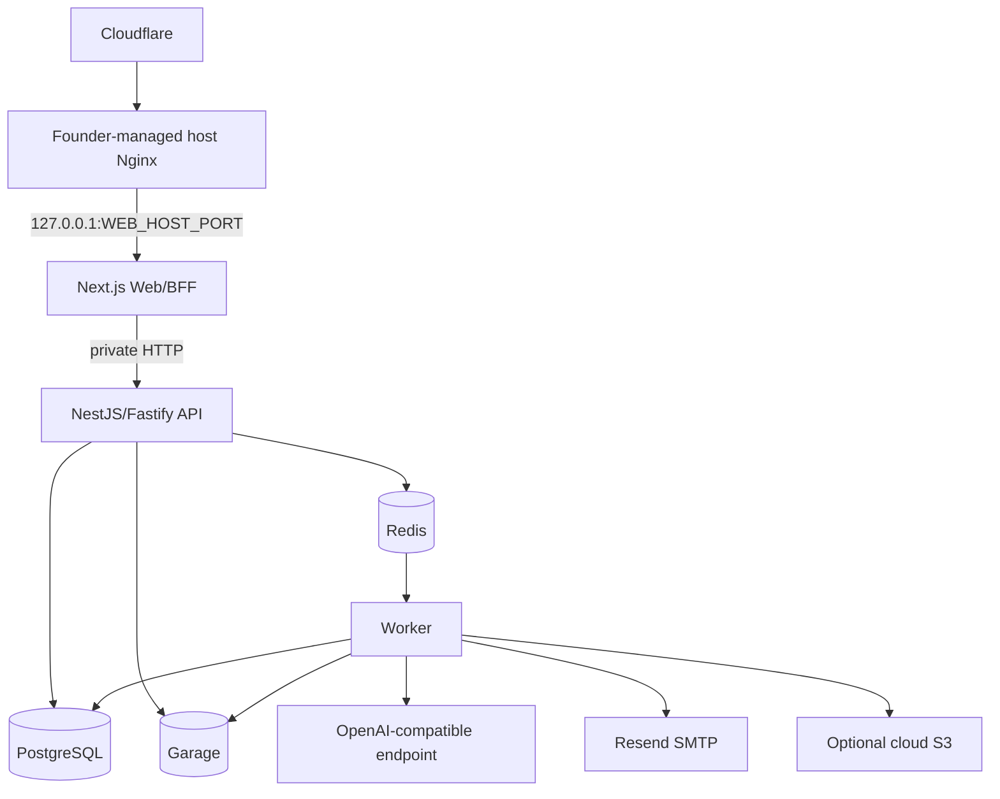
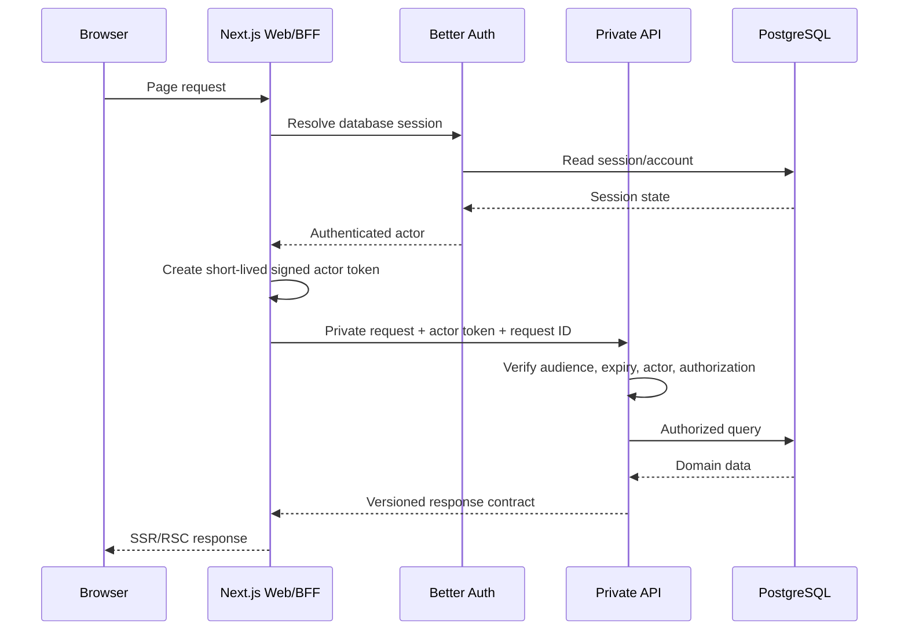
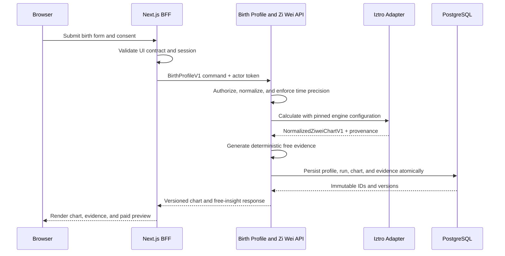
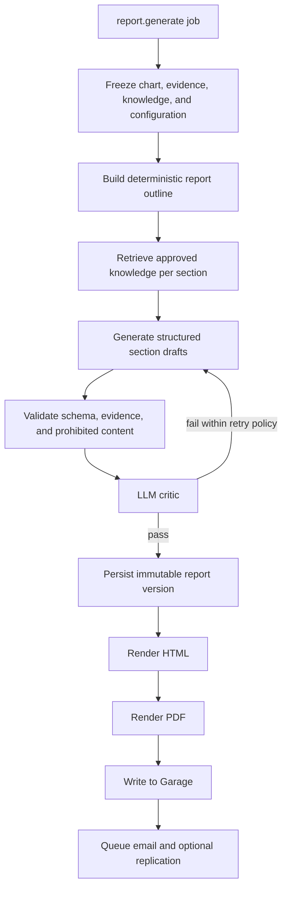
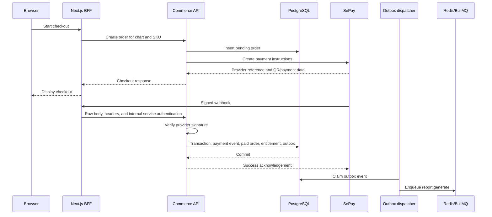
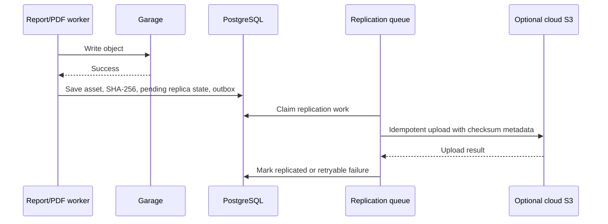
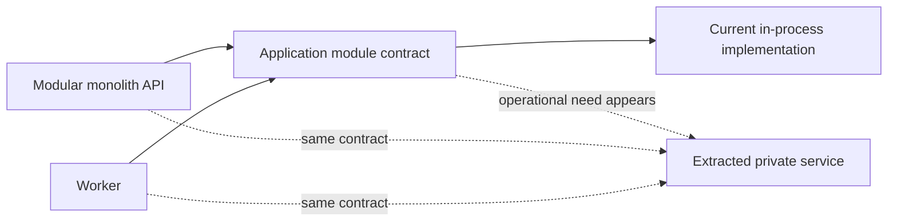

# Lá Số Việt Platform Architecture Design

**Status:** Founder-approved for implementation planning; Terra pass 2 complete
**Date:** 2026-08-31
**Phase:** Planning only
**Primary repository:** `harris1111/lasoviet.vn`

## 1. Purpose

This document defines the target architecture for Lá Số Việt, a Vietnamese-first
astrology and divination platform built around deterministic calculations,
versioned evidence, approved knowledge, and constrained AI interpretation.

This is a design specification, not an implementation plan. It does not
authorize scaffolding, dependency installation, migrations, infrastructure
changes, deployment, or product code.

The implementation plan will be written only after the founder reviews and
approves this file. Approval of this specification authorizes only the writing
of the implementation plan. Product implementation begins only after the
founder separately and explicitly approves the completed implementation plan.

## 2. Product Invariant

The product pipeline is:

```text
User input
    -> deterministic calculation
    -> normalized domain facts
    -> deterministic evidence
    -> approved knowledge retrieval
    -> AI interpretation
    -> validation and critic
    -> immutable versioned report
```

The AI layer must never calculate a chart from free-form text. Calculation
engines own chart facts. AI may only interpret facts and evidence supplied by
the application.

## 3. Scope

### 3.1 P0 scope

- Vietnamese-first product with English support.
- Next.js 16 web application and browser-facing BFF.
- Private NestJS API using the Fastify adapter.
- One general BullMQ worker deployable.
- PostgreSQL, Redis, and Garage on one VPS through Docker Compose.
- Better Auth with database sessions.
- Email/password and Google OAuth.
- SePay checkout and payment webhooks.
- Zi Wei calculation through an iztro adapter.
- One complete paid Zi Wei SKU before the remaining launch SKUs.
- Evidence-backed AI reports through a founder-provided OpenAI-compatible
  endpoint.
- Responsive HTML reports, PDF generation, private object storage, email
  delivery, and optional cloud S3 replication.
- Operational admin tools for payments, reports, failures, regeneration,
  support, and audit records.

### 3.2 Explicitly deferred

- Public backend host or public mobile API.
- Service-per-discipline microservices.
- Kubernetes, Kafka, event sourcing, and distributed transactions.
- Solar Return until a compatible, licensed calculation implementation is
  approved.
- Unknown-time Zi Wei scenario comparison and birth-time rectification.
- Full editorial CMS.
- Public report sharing.
- Palmistry and face-reading production workloads.
- Feng Shui physical-product commerce.

## 4. Sources Inspected

The design was produced after inspecting:

- `README.md`
- `MASTER_CONCEPT.md`
- `docs/01-evidence-and-insights.md` through
  `docs/11-discipline-expansion-specs.md`
- all files under `config/`
- `data/README.md`
- `data/source_manifest.md`
- `data/lasoviet_research_master.xlsx`
- `data/divination_repo_coverage.xlsx`
- current source, package metadata, tests, licenses, and Git history of the
  audited upstream repositories listed below

Workbook data was treated as a research snapshot, not as current license or
repository authority.

## 5. Current-State Audit

### 5.1 Repository state

- The primary repository currently contains planning, research, configuration,
  and product specification files rather than an implemented application.
- The source package therefore requires a clean initial workspace structure;
  no application code migration is necessary.
- Legacy repository documents are predominantly Vietnamese. New documents are
  English. A repository-wide translation remains separate scope.

### 5.2 Confirmed contradictions and stale material

1. `docs/08-domain-and-infrastructure.md` and
   `docs/06-technical-architecture.md` describe a public
   `api.lasoviet.vn`. The approved P0 design uses Next.js as the public BFF and
   keeps the NestJS API private.
2. `docs/10-decision-log.md` and `docs/11-discipline-expansion-specs.md`
   contain language that treats founder silence as approval. Silence is never
   approval. D-019 and D-020 are now explicitly resolved.
3. Existing Zi Wei notes treated Mingyu and iztro as potentially independent
   cross-checks. Mingyu delegates Zi Wei calculation to iztro, so this is not
   independent validation.
4. Existing Western-engine analysis predates the current Celestine audit.
   Celestine is now approved as the wrapped Wave 3 production dependency.
5. `config/sitemap.json` is stale relative to the current sitemap and
   discipline expansion documents. The target design replaces independent
   sitemap configuration with one route registry.
6. Workbook decision identifiers and Markdown decision identifiers are not
   consistently aligned. Future records must include stable decision IDs,
   dates, sources, and supersession notes.
7. Root-repository license detection for Mingyu is insufficient. The reusable
   package is `packages/core`, whose package-level license is MIT.
8. Several reference repositories state "MIT" only in README text without a
   license file or package license grant. They remain reference-only.

### 5.3 Missing architecture requirements now resolved

- Backend framework and transport.
- Public Zi Wei rule set.
- Payment provider.
- Refund and regeneration policy.
- Unknown birth-time behavior.
- Cloud-replica deletion behavior.
- AI provider shape.
- Transactional email provider.
- Authentication foundation and launch login methods.
- Initial paid SKU.
- Account deletion behavior.
- Free-preview depth.
- VPS ingress ownership.

### 5.4 Founder deployment invariant

On 2026-08-31, the founder corrected the deployment design to reject a
conventional host port and required a deployment-selected loopback port while
retaining founder ownership of host Nginx. This is recorded as a direct founder
deployment invariant, not as a security claim derived from port randomness.

The invariant is:

- A fixed internal container port is allowed.
- The production host port is a required, validated, deployment-selected
  loopback-only port.
- The selected host port remains stable so founder-managed Nginx does not lose
  its upstream.
- Port randomness is collision avoidance and routing hygiene, not security.
- Repository automation never modifies host Nginx.

## 6. Founder-Approved Decisions

| Decision | Approved outcome |
|---|---|
| Backend | NestJS with the Fastify adapter |
| Architecture | Modular monorepo and modular monolith |
| Public API | No public backend host in P0 |
| Zi Wei engine | iztro through a Lá Số Việt adapter |
| Zi Wei rule set | iztro `default`, with no public P0 selector |
| Payment | SePay through a `PaymentProvider` adapter |
| Refund/regeneration | Balanced policy with technical retries, defect correction, one same-person input correction within 24 hours, and defined refund cases |
| Unknown birth time | Store unknown/range precision, but do not create or sell Zi Wei reports unless one birth branch can be determined |
| Cloud deletion | Propagate Garage deletions to cloud S3 through idempotent tombstones |
| Product AI | Founder-provided OpenAI-compatible endpoint; URL, key, and model are implementation-time inputs |
| Email | Resend through SMTP using founder-provided connection details |
| Authentication | Better Auth with PostgreSQL database sessions |
| Login methods | Verified email/password and Google OAuth |
| Numerology | Wave 1.5 after the first paid Zi Wei flow is stable |
| Feng Shui | Utility scope in Wave 6; no physical-product commerce |
| Western engine | Celestine as the wrapped Wave 3 production dependency |
| First paid SKU | `ZIWEI-IDENTITY-P0`, "Bản mệnh & tiềm năng" |
| Launch price | VND 79,000 baseline, treated as a market hypothesis |
| Account deletion | Immediate access revocation, 30-day recovery period, then purge |
| Free experience | Full base chart, three evidence-backed insights, one strength/tension pair, and a real 10-15% paid preview |
| VPS ingress | Existing founder-managed host Nginx |
| Web host bind | Loopback-only, deployment-selected stable unused port in `49152-65535`; never hard-code host port 3000 |

## 7. Architecture Alternatives

### 7.1 Selected: modular monorepo

The selected approach separates public web, private HTTP, and asynchronous
processing while sharing domain modules and contracts.

Benefits:

- Clear browser trust boundary.
- One backend domain model.
- Direct in-process domain calls.
- Independent API and worker scaling without service fragmentation.
- Testable engine and provider adapters.
- Realistic operation on one VPS.

### 7.2 Rejected: Next.js full stack without a private API

This would reduce the number of deployables but would encourage identity,
commerce, calculation, and report logic to spread across route handlers and
Server Actions. It also contradicts the approved BFF-to-private-backend
boundary.

### 7.3 Rejected: service per discipline

This would add network contracts, failure modes, deployment units, migrations,
and operational cost before real scaling evidence exists.

## 8. Repository Topology

```text
lasoviet.vn/
├── apps/
│   ├── web/
│   ├── api/
│   └── worker/
├── packages/
│   ├── backend/
│   ├── contracts/
│   ├── engine-adapters/
│   ├── database/
│   ├── config/
│   ├── observability/
│   └── test-fixtures/
├── docs/
│   └── superpowers/
└── package.json
```

Use a `pnpm` workspace. Nx, a runtime plugin marketplace, and additional
monorepo orchestration are not required for P0.

### 8.1 Application ownership

`apps/web` owns:

- Next.js rendering and routing.
- Public pages and localized SEO.
- Better Auth browser ingress.
- SePay webhook ingress.
- Signed-download ingress.
- BFF calls to the private API.

`apps/api` owns:

- Private HTTP bootstrap.
- Request authentication and authorization.
- Validation of internal actor tokens.
- Transactional application commands and queries.
- Private health and readiness endpoints.

`apps/worker` owns:

- BullMQ bootstrap.
- Queue selection through `WORKER_QUEUES`.
- Report, validation, PDF, email, embedding, and replication processors.
- Worker health and heartbeat behavior.

`packages/backend` owns:

- Domain and application modules.
- Ports and repository interfaces.
- Transaction boundaries.
- Policies and state machines.

`packages/contracts` owns:

- Versioned runtime schemas.
- Internal API request and response contracts.
- Domain event and job payload schemas.
- Normalized calculation contracts.

`packages/engine-adapters` owns:

- Vendor imports.
- Vendor-to-normalized mappings.
- Capability declarations.
- Provenance and adapter contract tests.

## 9. Dependency Direction

```text
Web transport       API transport       Queue transport
      \                  |                  /
       \                 |                 /
            application modules
                    |
               domain policies
                    |
          ports and owned contracts
                    |
    database / engine / provider adapters
```

Rules:

- Transport code does not implement domain rules.
- Domain modules do not import Next.js, Fastify, BullMQ, or vendor engine
  payloads.
- Cross-domain synchronous work uses application-service calls in process.
- A module must not read another module's tables as an undocumented API.
- Queue payloads contain stable IDs and versions, not full private records.
- Generic `shared-utils` packages are prohibited.

## 10. Runtime Topology



Only the web container publishes a host port. The host binding is:

```text
127.0.0.1:${WEB_HOST_PORT}:3000
```

The container port may be fixed. `WEB_HOST_PORT` is selected once per
environment, stored outside Git, and kept stable across restarts. Repository
automation does not modify host Nginx.

The random high host port avoids collisions and accidental conventional-port
exposure. It is not treated as an authentication or authorization control.

## 11. SSR and BFF Flow



The browser never supplies a trusted user ID. The API performs authorization
even though it is private.

## 12. Free Chart Calculation Flow



Calculation failure does not create a partial chart. Repeated submission with
the same normalized input and engine configuration uses an idempotent
calculation key.

## 13. Birth Profile

`BirthProfileV1` is the shared input contract for calculation systems.

It records:

- Original submitted calendar and local date/time.
- Calendar type.
- IANA timezone.
- Location where a system requires it.
- Gender where a system requires it.
- Locale.
- `time_precision`: `exact_minute`, `branch_only`, `range`, or `unknown`.
- Derived UTC and calendar values.
- Conversion library and timezone-data provenance.
- Consent version and collection timestamp.

Display names and account identifiers are stored separately from calculation
payloads.

### 13.1 Unknown-time behavior

- A range that resolves to one Zi Wei branch may proceed with a limitation
  marker.
- A range crossing multiple branches cannot produce a paid Zi Wei report.
- A fully unknown birth time cannot produce a paid Zi Wei report.
- P0 does not choose noon, midnight, or another silent default.
- Multi-scenario comparison and rectification are deferred.

## 14. Calculation Engine Contract

Conceptual interface:

```ts
interface CalculationEngine<Input, Output> {
  capabilities(): EngineCapabilities;
  calculate(
    input: Input,
    config: EngineConfig,
  ): Promise<EngineResult<Output>>;
}
```

Each result includes:

- Normalized output.
- Engine and package version.
- Adapter version.
- Rule-set configuration.
- Input hash.
- Calculation timestamp.
- Warnings and limitations.
- Private raw vendor snapshot for mapping audit.

Normal application modules never import vendor-specific output types.

### 14.1 Zi Wei

```text
BirthProfileV1
    -> ZiweiEngine
    -> IztroAdapter
    -> iztro 2.6.0
    -> NormalizedZiweiChartV1
```

P0 uses:

- iztro `default`, based on the package's common
  `Zi Wei Dou Shu Quan Shu` configuration.
- One confirmed `timeIndex`.
- Versioned mutagen, brightness, year-boundary, horoscope-boundary,
  age-boundary, and late-Zi-hour configuration.

Iztro does not expose native location, timezone, or true-solar-time inputs.
The adapter must not claim those corrections were performed.

### 14.2 Eastern systems

Mingyu `packages/core` is the wrapped production dependency for approved
BaZi, Liu Yao/I Ching, Tarot, date-selection, zodiac, and Feng Shui waves.
Engine capability does not make a feature public automatically.

### 14.3 Western system

Celestine is the wrapped production dependency for Wave 3 tropical Western
astrology. The audited version supports natal calculations, planets, angles,
seven house systems including Placidus, aspects, retrogrades, nodes, transits,
secondary progressions, and solar-arc directions.

The audited source does not expose a Solar Return API. Solar Return is not part
of the initial Wave 3 acceptance criteria.

## 15. Capability Registry

The registry is controlled product metadata, not a dynamic plugin system.

Conceptual fields:

```text
id
engine
enabled
public
release_wave
requires_birth_date
requires_birth_time
requires_exact_minute
requires_location
supports_chart
supports_timeline
supports_compatibility
supports_free_tool
supports_paid_report
supports_ai
```

Technical availability, public availability, and paid availability are
separate states.

## 16. Evidence Contract

```text
Normalized chart
    -> versioned deterministic rules
    -> EvidenceSet
    -> approved knowledge retrieval
    -> AI claim candidates
    -> deterministic validator
    -> language and safety critic
```

An `EvidenceItem` includes:

- Stable evidence key.
- Discipline and method.
- Rule version.
- Source references.
- Conditions.
- Interpretation bounds.
- Confidence.
- Birth-time sensitivity and other limitations.
- Risk tags.

An AI claim must reference valid evidence IDs from the frozen report snapshot.
Claims without valid evidence are rejected.

## 17. Knowledge Architecture

Knowledge is curated and versioned.

Each document and chunk records:

- Discipline.
- Locale.
- Source and attribution.
- License or permitted-use basis.
- Content hash.
- Approval state.
- Knowledge version.

Retrieval order:

1. Filter by discipline, locale, report section, approval, and version.
2. PostgreSQL full-text retrieval.
3. Optional pgvector semantic retrieval after the embedding phase is enabled.
4. Deterministic reranking and bounded context selection.

The application does not perform open-web retrieval while generating a paid
report.

## 18. AI Provider Boundary

The product uses a founder-provided OpenAI-compatible endpoint.

Configuration is environment-based:

```text
AI_BASE_URL
AI_API_KEY
AI_MODEL
AI_TIMEOUT
AI_MAX_RETRIES
AI_FEATURE_JSON_SCHEMA
AI_FEATURE_TOOL_CALLING
```

The adapter must not assume full OpenAI Responses API compatibility.
Implementation begins with a capability probe for:

- Structured JSON or tool-call behavior.
- Timeout behavior.
- Retry semantics.
- Context and output limits.
- Stable model identification.

If the endpoint cannot meet the approved report contract, implementation stops
for the affected phase. Terra returns the evidence and reviewed concern to Sol;
Sol presents the options and recommendation to the founder. The implementor
must not silently select another endpoint or model.

Inputs sent to AI exclude names, emails, order data, and raw birth-profile
fields that are not required for interpretation.

Production use also requires a recorded review of the endpoint's data
processing, retention, access-control, and incident-notification terms.

## 19. Report Generation



The report state machine persists progress so page refreshes and worker
restarts do not lose state.

Draft or failed-critic content is never shown as a completed report.

### 19.1 Versioning

Every report records:

- Input and chart version.
- Engine, adapter, and rule set.
- Evidence version.
- Knowledge version.
- Provider and model.
- Prompt and template version.
- Locale.
- Render version.
- Superseded report reference.

Existing report versions remain immutable.

### 19.2 Refund and regeneration

- Technical failures retry without another payment.
- Verified engine, evidence, prompt, or system defects permit free
  regeneration.
- Regeneration creates a new version and preserves the old version as
  superseded.
- One same-person input correction is allowed within 24 hours, subject to
  support audit and abuse controls.
- Duplicate charges, inability to deliver, and material failure against the
  advertised service permit a full refund.
- Final public wording and statutory retention periods require legal and
  accounting review before launch.

### 19.3 Report safety contract

Paid and free interpretations must:

- Use non-fatalistic, conditional language.
- Distinguish observation, interpretation, limitation, and suggested action.
- Avoid unsupported Barnum statements.
- Avoid psychological or medical diagnosis.
- Avoid fear-based upselling.
- State that the product does not replace medical, legal, financial, mental
  health, or other licensed professional advice.

The system must reject claims that make absolute or factual predictions about:

- Accidents or physical harm.
- Death.
- Serious disease.
- Betrayal or criminal conduct.
- Legal outcomes.
- Investment performance, bankruptcy, income, or guaranteed financial results.

Every major claim requires evidence and must remain within the interpretation
bounds attached to that evidence. The deterministic validator enforces
evidence references and prohibited categories before the language/safety critic
runs.

## 20. Commerce and Payment Flow



The SePay webhook is the source of payment confirmation after signature and
amount validation. Browser redirects are not payment proof.

Idempotency constraints prevent repeated webhooks from creating additional
entitlements or reports.

## 21. Initial Product Funnel

The initial complete funnel is:

```text
Landing
    -> birth form and consent
    -> deterministic base chart
    -> three evidence-backed insights
    -> one strength and one tension
    -> real 10-15% paid preview
    -> ZIWEI-IDENTITY-P0 checkout at VND 79,000
    -> SePay confirmation
    -> generated report
    -> private HTML
    -> PDF
    -> email
```

The price and preview percentage remain measurable market hypotheses. Changes
must be made through explicit experiments, not undocumented edits.

## 22. PostgreSQL Persistence

Use Drizzle ORM with explicit, reviewable SQL migrations.

Production never uses schema push. A one-shot migration service applies
committed migrations before new API and worker versions receive traffic.

### 22.1 Table groups

```text
auth_*
consents
birth_profiles
calculation_runs
charts
evidence_sets
evidence_items
knowledge_documents
knowledge_chunks
orders
payment_events
entitlements
reports
report_versions
assets
asset_replicas
deletion_requests
outbox
audit_logs
```

### 22.2 Transaction rules

- Payment event, paid order, entitlement, and outbox event commit together.
- PostgreSQL is the business source of truth.
- Redis is never the sole owner of payment, entitlement, or report state.
- Unique constraints protect provider event IDs, order idempotency keys, and
  entitlement issuance.
- Chart and report versions are append-only.
- Cross-module changes occur through application services and explicit
  transactions.

## 23. Asynchronous Work

One worker codebase consumes configurable queue sets:

```text
report.generate
report.validate
pdf.render
email.send
knowledge.embed
storage.replicate
storage.delete-replica
```

Future deployments may select queues with:

```text
WORKER_QUEUES=report.generate,pdf.render
```

This is a deployment option, not a requirement to create additional services
in P0.

All jobs are idempotent and use bounded retries, backoff, terminal failure
state, and operational visibility.

## 24. Object Storage

Garage is authoritative for private generated objects.

- Buckets are private.
- Object keys use opaque IDs and contain no names, emails, or birth details.
- Downloads require owner authorization before a short-lived signed URL is
  issued.
- Report HTML remains in PostgreSQL, so PDF storage failure does not erase the
  completed report.
- P0 has no public report sharing.

## 25. Cloud S3 Replication



Rules:

- Replication direction is Garage to cloud S3 only.
- No cloud configuration is a valid normal state.
- Cloud outage never causes a successful Garage write to fail.
- Integrity uses a stored SHA-256 value and must not rely only on multipart
  ETags.
- Repeated failures use backoff and deduplicated operational alerts.
- Deletion creates a durable tombstone and propagates to cloud S3.
- The replica is not called a backup because deletions are propagated.

## 26. Authentication and Authorization

Better Auth runs through the Next.js BFF with PostgreSQL database sessions.

Launch methods:

- Verified email and password.
- Google OAuth.

Required controls:

- Secure, HTTP-only cookies.
- Email verification.
- Password reset.
- Session revocation.
- Account linking only when provider email verification is trustworthy.
- Server-side route protection.
- API authorization independent of frontend UI state.
- RBAC for admin operations.

The BFF sends the private API a short-lived signed actor token containing a
minimum actor identity, session reference, audience, expiry, and request ID.

## 27. Consent and Deletion

Consent records are versioned and auditable.

Account deletion:

1. Immediately revoke sessions and disable access.
2. Enter a 30-day recoverable deletion state.
3. After 30 days, purge birth profiles, calculations, chart content, report
   content, Garage assets, and cloud replicas.
4. Anonymize analytics where feasible.
5. Retain only transaction and audit fields required by law, accounting, or
   active disputes.

Transaction retention is separated from birth data and report content.

Future biometric workloads require separate consent, retention, buckets,
runtime isolation, and approval.

## 28. Frontend Architecture

Use Next.js 16 App Router.

- Vietnamese is the default canonical locale.
- English routes live under `/en`.
- Public methodology, calculator, and knowledge pages use SSR/RSC as
  appropriate.
- Client Components are limited to interactive forms, chart navigation,
  evidence drawers, payment progress, and report progress.
- Private pages perform server-side authorization and use `noindex`.
- Server Actions validate UI intent and call the private API.
- Route Handlers provide only necessary public ingress.

The sitemap is generated from one route registry. Legacy
`config/sitemap.json` is not an independent source of truth.

### 28.1 Internationalization

Vietnamese and English are first-class runtime languages.

```text
messages/
├── vi/
│   ├── common.json
│   ├── navigation.json
│   ├── profile.json
│   ├── ziwei.json
│   ├── reports.json
│   └── settings.json
└── en/
    └── matching JSON files

content/
├── vi/
└── en/
```

Rules:

- The application provides a runtime language switch and persists the selected
  locale in the route/session preference.
- Normal UI text uses JSON message resources. User-facing text is not
  hard-coded throughout TSX.
- Long-form editorial content is stored separately under locale-specific
  content roots.
- Domain contracts store language-neutral IDs such as `planet.sun`,
  `aspect.conjunction`, and `ziwei.palace.life`.
- Vendor-localized values are normalized to stable IDs inside the adapter
  before application modules receive them.
- Display labels are resolved only at presentation or report-render time.
- Date, time, number, and VND formatting use the active locale while preserving
  canonical stored values.
- Report versions record their output locale. Changing report language creates
  a new rendered/report version rather than mutating existing paid content.
- CI performs automatic VI/EN file and key-parity checks and fails on missing,
  extra, or incompatible interpolation keys.
- Adapter and report tests cover Vietnamese and English mappings for all P0
  normalized values.

## 29. Admin P0

Admin capabilities include:

- Order and payment-event inspection.
- Entitlement inspection.
- Report state and failure inspection.
- Policy-authorized regeneration actions with reason and audit record.
- Support-case tracking.
- Audit-log inspection.

Admin cannot mutate an existing immutable chart or report version.

Editorial content and approved knowledge begin as version-controlled repository
files. A full CMS UI is deferred.

## 30. Deployment

The P0 target is one existing VPS with Docker Compose.

Services:

```text
web
api
worker
postgres
redis
garage
migrate
```

The host Nginx configuration is founder-owned and outside repository
automation.

### 30.1 Ports and networks

- `web` publishes only
  `127.0.0.1:${WEB_HOST_PORT}:3000`.
- `WEB_HOST_PORT` is a validated unused port in `49152-65535`, selected once
  per environment, stored outside Git, and remains stable.
- `api`, `postgres`, `redis`, and `garage` publish no host ports.
- Containers communicate by Compose service name on private bridge networks.

### 30.2 Startup and upgrades

1. Verify backups and image digests.
2. Run migration compatibility checks.
3. Run the one-shot migration service.
4. Start or replace API and worker.
5. Start or replace web.
6. Verify readiness and critical smoke flows.
7. Keep the prior application image available for rollback.

Destructive schema cleanup is separated from the release that stops using the
old schema.

### 30.3 Persistence

- PostgreSQL, Redis, and Garage use explicit persistent volumes.
- Database backup and restore procedures are separate from cloud object
  replication.
- Backups require encryption, access control, retention, and restore drills.

## 31. Observability

P0 observability includes:

- Structured JSON logs to stdout.
- Request and correlation IDs.
- Order, report, and job IDs.
- Liveness and readiness endpoints.
- Queue depth and retry/failure counts.
- Report generation latency.
- Engine calculation errors.
- Payment webhook failures.
- Garage errors.
- Cloud-replication failures and lag.
- Email delivery failures.

Never log:

- Passwords or API keys.
- Full birth profiles.
- Full private reports.
- AI prompts containing private data.
- Signed object URLs.

P0 may expose Prometheus-compatible metrics without deploying a large tracing
platform.

## 32. Testing Strategy

Testing prioritizes core correctness and deployable end-to-end behavior.

### 32.1 Calculation and contract tests

- Adapter mapping tests.
- Normalized-schema tests.
- Rule and evidence tests.
- Vendor-upgrade contract tests.
- I18n mapping and VI/EN key-parity tests.
- Golden fixtures for solar/lunar conversion boundaries.
- Leap lunar month fixtures.
- Solar-term boundary fixtures.
- Hour-boundary and late/early Tý-hour behavior.
- Timezone-difference and historical timezone/DST fixtures.
- Location-sensitive Western calculation fixtures.
- Unknown birth-time and birth-branch-only precision fixtures.
- Independent comparison with Tianji where methods genuinely overlap.
- Important P0 fixtures cross-checked against at least two genuinely
  independent engines, trusted worked examples, or expert-verified sources.

Mingyu Zi Wei is not counted as independent validation.

### 32.2 Integration tests

- PostgreSQL transactions and unique constraints.
- Transactional outbox behavior.
- BullMQ retry and idempotency.
- Garage writes and signed downloads.
- Cloud-replication degraded mode.
- Better Auth session and authorization paths.
- SePay signature, amount validation, replay, and idempotency.
- Account-deletion state transitions.

### 32.3 E2E and deployment smoke

The release-critical flow is:

```text
landing
    -> birth form
    -> free chart
    -> free evidence
    -> checkout
    -> SePay webhook
    -> entitlement
    -> report generation
    -> report validation
    -> HTML report
    -> PDF
    -> Garage download
    -> email
```

Tests focus on happy paths, full flows, deployment smoke, and
calculation/payment/privacy boundaries. Genuinely niche cases are recorded for
later phases with their risk and trigger for promotion.

### 32.4 P0 release gates

Public launch is blocked until:

- 100% of the approved P0 fixture suite passes.
- No severity-1 calculation, payment, authorization, privacy, or data-leakage
  defect remains open.
- Twenty internal reports pass the documented rubric for chart correctness,
  evidence coverage, personal specificity, Vietnamese clarity, internal
  consistency, actionability, safety/non-fatalism, and repetition control.
- Every internal report scores at least 4/5 for correctness and safety.
- No reviewed report contains an absolute accident, death, disease, legal, or
  financial claim.
- The release-critical E2E flow passes in the target Docker Compose and
  founder-managed Nginx topology.
- Sample report, methodology, privacy, terms, refund/regeneration, and support
  materials are available.
- Production dependency pins, license evidence, SBOM, and adapter contract
  tests pass the first-use gate.

## 33. Dependency Integration Matrix

Audit date: 2026-08-31.

| Repository | Audited commit | License finding | Class | Production role |
|---|---|---|---|---|
| `harris1111/lasoviet.vn` | `d89bfc1` | Product repository | Product | Sole product source of truth |
| `SylarLong/iztro` | `1ba89cca` | MIT, package 2.6.0 | B | Wrapped Zi Wei engine |
| `Brhiza/mingyu` `packages/core` | `f11b31e6` | Package-level MIT, package 0.2.0 | B | Wrapped Eastern/divination engine |
| `Anonyfox/celestine` | `954d6331` | MIT, package 0.2.1 | B | Wrapped Wave 3 Western engine |
| `Zijian-Ni/tianji` | `a48cf098` | MIT, package 0.3.0 | C | Independent Eastern fixtures/reference |
| `ziweiknows/ziwei-chat` | `ceef938a` | Apache-2.0 | D | AI/evidence architecture reference |
| `ziweiknows/ziwei-chart` | `b172413d` | GPL-3.0 | D | UX reference only |
| `g-battaglia/kerykeion` | `b18848eb` | AGPL-3.0 | D | Western feature/reference only |
| Horosa | `b1a957f2` | AGPL-3.0 | D | Broad feature/reference only |
| `VedAstro/VedAstro` | `fcb4dede` | Root MIT; SwissEphNet/Swiss Ephemeris transitive review required | D | Future Vedic/reference only |
| `Crazycreate/liuyao` | `a43983b2` | README says MIT; no license file or package license field | D | Methodology/reference only |
| `Johnson-Jia/liuyao-divination` | `1a5a78b5` | MIT | C | Liu Yao fixtures/methodology reference |
| `lihongjie0209/meihua-app` | `b282c5cf` | README says MIT; no license file; private package | D | Mei Hua reference only |
| `yeonsumia/palmistry` | `17610c3f` | Apache-2.0 | D | Future palm-CV reference only |
| `darktaoist/aura` | `5b5640cb` | README says MIT; no license file | D | Future on-device/privacy UX reference only |

Classification:

- A: direct production dependency.
- B: wrapped production dependency.
- C: independent validation/reference.
- D: architecture, UX, feature, or methodology reference only.
- E: rejected.

No audited specialty engine is class A because all production engine access is
required to pass through Lá Số Việt-owned adapters.

### 33.1 Production runtime dependency evidence

The following package metadata was checked on 2026-08-31 against local
manifests and npm registry metadata. Registry metadata is evidence for the
audited package version, not a substitute for scanning the resolved production
lockfile and package contents.

| Parent | Runtime dependency | Declared constraint | Audited version | License evidence | Boundary |
|---|---|---:|---:|---|---|
| iztro 2.6.0 | `dayjs` | `^1.11.10` | 1.11.10 | MIT | Internal iztro time utility; protected by Zi Wei adapter fixtures |
| iztro 2.6.0 | `i18next` | `^23.5.1` | 23.5.1 | MIT | Internal iztro localization; vendor labels normalized by the adapter |
| iztro 2.6.0 | `lunar-lite` | `^0.2.8` | 0.2.8 | MIT | Calendar-critical; protected by calendar and boundary fixtures |
| iztro 2.6.0 | `lunar-typescript` | `^1.7.8` | 1.7.8 | MIT | Calendar-critical; protected by calendar and boundary fixtures |
| mingyu-core 0.2.0 | `@soul-atelier/xuankong` | `0.2.1` | 0.2.1 | MIT | Xuankong capability behind the Mingyu adapter |
| mingyu-core 0.2.0 | `astronomy-engine` | `2.1.19` | 2.1.19 | MIT | Astronomical calculations behind the Mingyu adapter |
| mingyu-core 0.2.0 | `tyme4ts` | `^1.3.3` | 1.5.2 | MIT | Calendar/time foundation behind the Mingyu adapter |
| mingyu-core 0.2.0 | `celestine` | `^0.2.1` | 0.2.1 | MIT | Mingyu capability dependency; not the canonical Western contract |
| mingyu-core 0.2.0 | optional peer `iztro` | `^2.5.8` | 2.6.0 target | MIT | Zi Wei delegation; never an independent validator |

### 33.2 Production dependency first-use gate

Before a production engine is first imported:

1. Replace production-facing semver ranges with an exact approved resolution
   through the root manifest, workspace override, and lockfile.
2. Verify the resolved tarball/package license file, package metadata,
   repository source, and notices for every direct and transitive runtime
   dependency.
3. Generate an SBOM and fail the gate on unknown, GPL, AGPL, incompatible,
   missing, or materially changed license evidence.
4. Record the exact package, version, integrity hash, source URL, license
   evidence, owner, and audit date.
5. Run adapter, normalized-contract, calendar/time, and golden-fixture tests.
6. Verify that duplicate transitive engines resolve to one reviewed compatible
   version where possible.

An upstream dependency change is handled in a dedicated upgrade change with a
license diff, changelog review, SBOM diff, and contract-test evidence.

If a transitive dependency becomes unsuitable, the project first keeps the
last approved pin while evaluating an upstream fix or workspace override. If
that is not safe or legally compatible, the parent engine is replaced behind
the existing adapter boundary. No normal domain module changes its contract to
accommodate a vendor license problem.

## 34. Production Dependency Policy

For every production dependency:

- Pin an exact reviewed version or lockfile resolution.
- Record package path and license.
- Track SBOM and license notices.
- Run adapter contract tests before upgrades.
- Review changelog and upstream activity.
- Define replacement boundaries.
- Never import GPL or AGPL production code without explicit founder and legal
  approval.

Swiss Ephemeris transitive licensing prevents treating VedAstro's root MIT
license as the complete production-license answer.

## 35. Scaling and Future Extraction

Default communication:

```text
synchronous domain work -> direct in-process call
background work -> Redis/BullMQ
future extracted synchronous service -> private HTTP or RPC
```



Extraction requires a real reason such as CPU/GPU needs, runtime incompatibility,
security isolation, independent failure, or independently scaled load.

Likely long-lived monolith modules:

- Identity and consent.
- Birth profiles.
- Zi Wei, BaZi, basic Western, numerology, Tarot, I Ching, and Feng Shui.
- Commerce and entitlements.

Likely asynchronous or extractable workloads:

- AI report generation and critic.
- PDF.
- Email.
- Embedding.
- Storage replication.
- Future image and biometric analysis.

## 36. Engineering and Public Roadmaps

Engineering integration order and public launch order remain separate.

### 36.1 Engineering order

1. Workspace, contracts, configuration, database, observability, and runtime
   boundaries.
2. BirthProfile, consent, and authentication.
3. Zi Wei adapter and normalized contract.
4. Evidence and knowledge foundations.
5. Free chart and preview.
6. SePay, entitlements, outbox, and report worker.
7. AI, critic, report versioning, PDF, Garage, email, and replication.
8. Admin and production readiness.
9. Additional approved engines and waves.

### 36.2 Public launch order

1. Zi Wei free chart and `ZIWEI-IDENTITY-P0`.
2. Remaining Zi Wei paid topics after quality and reliability gates.
3. Wave 1.5 acquisition tools, including numerology.
4. BaZi.
5. Western natal through Celestine.
6. Liu Yao/I Ching.
7. Compatibility after individual systems are stable.
8. Feng Shui utilities.

## 37. Risk Register

| Risk | Impact | Primary mitigation |
|---|---|---|
| Upstream calculation defect | Incorrect charts and loss of trust | Golden fixtures, independent reference checks, pinned versions |
| Adapter normalization defect | Correct vendor output becomes incorrect product data | Mapping contract tests and private raw snapshots |
| Rule-school ambiguity | Conflicting charts and explanations | Fixed rule set, displayed provenance, versioned configuration |
| Calendar/timezone boundary error | Incorrect core calculation | Canonical BirthProfile, core boundary fixtures, no silent defaults |
| Unknown birth-time misuse | Confident report from invalid input | Checkout gate and precision limitations |
| Upstream breaking change | Silent contract drift | Exact pins, changelog review, contract tests |
| License misclassification | Proprietary compliance exposure | Package-level audit, SBOM, reference-only defaults |
| AI hallucination | Unsupported or unsafe paid claims | Evidence IDs, deterministic validator, critic, immutable provenance |
| Knowledge gap | Weak or generic report | Approval workflow, versioning, coverage metrics |
| AI endpoint outage | Delayed paid report | Persisted state, retry/backoff, no fake fallback |
| Redis or worker failure | Delayed background work | PostgreSQL source of truth, outbox, idempotent retries |
| Payment replay or mismatch | Duplicate or incorrect entitlement | Signature, amount validation, unique constraints, transaction |
| Migration failure | Downtime or data corruption | One-shot reviewed migrations, backups, compatibility releases |
| Garage failure | PDF unavailable | HTML in PostgreSQL, retryable asset generation |
| Cloud S3 outage | Replica lag | Optional degraded mode, retries, observability |
| Replica drift | Missing or stale remote object | Checksums, explicit states, reconciliation |
| Privacy exposure | User harm and legal risk | Data minimization, private storage, authorization, deletion |
| Secret exposure | Provider or account compromise | Environment secrets, no Git, redacted logs |
| Biometric expansion | New privacy/runtime risk | Separate future consent, storage, runtime, and approval |
| Host-port collision | Failed deployment or incorrect Nginx routing | Stable deployment-selected loopback port |

## 38. Implementation-Time Inputs

These inputs are intentionally requested only when their implementation phase
starts:

- OpenAI-compatible base URL, API key, model, and supported capabilities.
- Resend SMTP host, port, username, password, sender domain, and sender address.
- SePay merchant, signing, webhook, and sandbox/production credentials.
- Optional cloud S3 endpoint, region, bucket, credentials, and lifecycle policy.
- Stable `WEB_HOST_PORT` selected for each environment.
- VPS resource inventory and offsite backup destination.
- Founder-managed Nginx upstream and TLS configuration.
- Legal and accounting confirmation of published refund wording and transaction
  retention periods.

These inputs do not block architecture approval. They block only their
respective implementation or release phase.

## 39. Open Decisions

No founder-level architecture decision remains open for this specification.
The inputs in the preceding section are requested only when their
implementation or release phase starts.

If an implementation-time capability probe, legal review, license review, or
VPS inspection contradicts this design, the affected phase stops and returns
the evidence to Terra. Terra reports the reviewed concern to Sol, and Sol
presents options and a recommendation to the founder. Silence is not approval.

## 40. Design Acceptance Criteria

This design is ready for implementation planning when:

- The founder approves this written specification.
- Approval of this specification authorizes planning only.
- No unresolved founder-level architecture decision remains.
- Upstream production engines remain behind owned adapters.
- The private API and one-VPS deployment remain realistic.
- Optional services have explicit disabled and degraded behavior.
- The complete paid flow can be tested end to end.
- Privacy, payment, and calculation correctness are release gates.
- The next artifact is a detailed implementation plan created through
  `superpowers:writing-plans`.
- Product implementation begins only after the founder explicitly approves the
  completed implementation plan.
