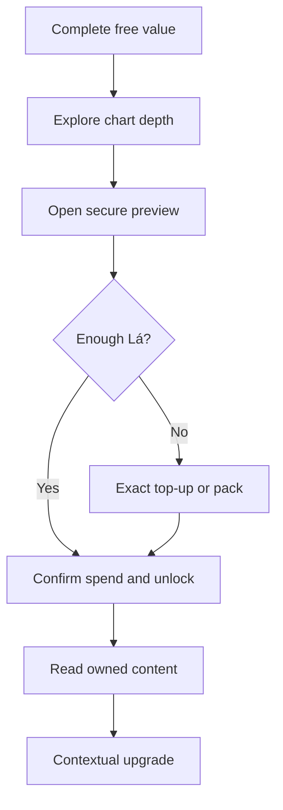

# Progressive Reveal, Lá Credits, and Conversion UI — Design Spec

**Date:** 2026-09-13
**Status:** Founder-approved product direction; specification awaiting founder review before implementation planning
**Scope:** Documentation and design only. No runtime, payment, wallet, report, or UI implementation is authorized by this document.
**Supersedes:** The VND-only clause of FD-036 and the wallet deferral in FD-039.
**Preserves:** FD-007, FD-029, FD-037, FD-038, FD-040 through FD-058, immutable commerce records, payment self-recovery, privacy boundaries, and the prohibition on fear-based conversion.
**Amended 2026-09-13 (round 2):** FD-064 through FD-068 override parts of §2.4, §3, §4, §7, §11, and §13. Read §18 first; where §18 conflicts with an earlier section, §18 wins.

## 1. Executive Decision

Lá Số Việt will adopt two conversion mechanisms inspired by the verified public AItuvi experience:

1. **Secure progressive reveal:** useful personalized content remains fully readable, while deeper sections use titles, truthful excerpts, structural previews, and a visual blur/fade representation to create a clear open loop.
2. **Lá credits:** a proprietary, non-transferable service credit used to unlock reports and, in later gated phases, individual sections and contextual AI answers.

The product must learn from AItuvi's conversion structure without copying its mystical claims, opaque value exchange, or dependency-forming patterns. The intended sequence is:

`free value → visible depth → secure locked preview → contextual CTA → verified account → exact top-up or credit pack → payment → atomic unlock → owned reading → contextual upsell`

## 2. Research Basis and Limits

### 2.1 Public AItuvi evidence verified on 2026-09-13

The audit directly observed or verified through public pages, public catalog APIs, and browser-delivered frontend bundles:

- A complete Zi Wei chart is shown before the deepest paid interpretation.
- The result surface exposes multiple reading areas: chart, palace readings, major periods, annual/monthly/daily readings, and topic readings.
- Locked content uses a contextual action formatted as `Mở - N Xu`.
- A confirmation dialog states the unlock cost before credit deduction.
- Insufficient balance preserves the context and routes the customer to add credits.
- Contextual AI shows remaining free, subscription, or package quota.
- When free quota is exhausted, the exact pending question is retained and the user is asked to spend 60 credits to unlock the answer.
- Direct report bundles, credit bundles, AI-question packages, and daily-reading subscriptions create four connected monetization rails.
- Real status and allowance data are used as merchandising: remaining opens, remaining questions, active subscription, and owned/unowned content.
- A daily trend visualization exists in the public frontend, but predictive trend charts are not in the approved Lá Số Việt natal scope.

Sources:

- <https://aituvi.com/>
- <https://aituvi.com/pricing>
- <https://aituvi.com/payment-instructions>
- Public catalog routes under `https://aituvi.com/fastapi/v2/payment/bundles`

### 2.2 Evidence boundary

No authenticated purchase was completed during the audit. Post-payment behavior is specified here only where it was observable in public frontend logic or can be reconciled with Lá Số Việt's own existing commerce design.

### 2.3 Observed public benchmark catalog

These prices describe the AItuvi public catalog observed on 2026-09-13. They are research evidence, not proposed Lá Số Việt prices.

| Revenue rail | Public options observed | Conversion role | Lá Số Việt decision |
|---|---|---|---|
| Direct interpretation bundles | 219,000 VND (315,000 VND reference); 999,000 VND (1,540,000 VND reference); 1,599,000 VND (2,437,000 VND reference) | High-value packaged outcomes and visible anchoring | Retain current 19/79-Lá ladder; do not copy unsupported crossed-out anchors |
| `Xu` credit bundles | 550 Xu for 109,000 VND; 1,650 for 269,000 VND; 3,750 for 659,000 VND; 11,950 for 1,399,000 VND | Prepaid balance, repeat unlocks, and pack upsell | Adopt closed-loop `Lá`, dual-denominated in VND, with exact top-up always available |
| AI question packages | 25 questions for 159,000 VND; 75 for 459,000 VND; 250 for 1,190,000 VND | Quota merchandising and contextual answer CTA | Learn the retained-question flow; keep AI monetization disabled under FD-037 |
| Daily-reading subscription | 59,000 VND/week; 219,000 VND/month; 2,099,000 VND/year | Recurring retention and time-based content | Defer until a reviewed predictive engine and a separately approved subscription model exist |

### 2.4 Pattern translation

| AItuvi pattern | What creates curiosity or conversion | Lá Số Việt adaptation | Boundary |
|---|---|---|---|
| Full chart beside deeper reading areas | The visible chart proves there is more structure than the free prose covers | Keep the 12-palace chart open and add reading/entitlement state | Never blur or paywall the calculated chart |
| `Mở - N Xu` on a selected item | Price appears at the moment of intent | Show one selected secure preview with `N Lá · N.000đ` | No grid of twelve competing purchase buttons |
| Insufficient-balance continuation | The original content remains the reason to top up | Preserve chart/topic/offer and make exact missing amount primary | A pack cannot be the only continuation path |
| Remaining AI quota and retained question | A real allowance and pending question make the next action concrete | Preserve the pattern for a future gated contextual assistant | No AI CTA or charge before the question engine, COGS, and safety gates pass |
| Daily trend chart | Time-based movement encourages repeated visits | Treat as future retention research | No natal pseudo-trend or invented forecast line |
| Multiple monetization rails | Direct purchase, balance, AI packages, and subscription monetize different intents | Sequence rails behind evidence and release gates | Do not launch every rail at once |

## 3. Design Principles

### 3.1 Curiosity is allowed; deception is not

The product may deliberately create curiosity and incompleteness when all of the following are true:

- the user has already received a useful, complete free insight;
- the locked area maps to a real deliverable;
- the visible title and excerpt accurately describe that deliverable;
- the price and ownership outcome are disclosed before payment;
- the lock is not framed as a hidden danger, urgent warning, or guaranteed future event.

### 3.2 Secure blur is a presentation state, not access control

Full locked plaintext must never be returned to an unauthorized browser and hidden only with CSS. The server returns only the authorized excerpt and safe preview metadata. A blurred or faded body is a non-reversible visual representation of additional depth, not the protected content itself.

### 3.3 Every visual metric must be true

Permitted metrics include real counts and states such as:

- 12 palaces in the calculated chart;
- three free insights delivered;
- four of twelve reading sections unlocked;
- eight sections available to unlock;
- number of evidence references attached to a section;
- known, ranged, branch-only, or unknown birth-time status;
- real report word count or reading time after the report exists;
- remaining Lá balance and exact missing amount.

Prohibited metrics include invented precision such as `87% lucky`, `92% compatible`, or a fabricated report-generation percentage.

### 3.4 Commercial state must remain secondary to user understanding

The chart, free insights, evidence, and limitations remain readable before the first paid CTA. Locked previews may increase visual salience after that value has been delivered, but they may not cover or obstruct the free result.

## 4. Lá Credit System

### 4.1 Customer-facing definition

| Attribute | Rule |
|---|---|
| Name | `Lá` |
| Definition | An internal service credit used to open content in Lá Số Việt |
| Nominal reference | `1 Lá = 1,000 VND` |
| Display | Product UI may lead with Lá, but every paywall, top-up confirmation, and payment order shows the VND equivalent |

Approved customer-facing examples:

- `Số dư: 43 Lá`
- `Mở phần này — 9 Lá`
- `Tương đương 9.000đ`
- `Bạn còn thiếu 12 Lá`
- `Nạp đúng 12 Lá — 12.000đ`
- `Đã hoàn lại 9 Lá vào số dư`
- `Nội dung đã mở · đọc lại không tốn Lá`

### 4.2 Brand expression

- Use a page, paper leaf, or bookmark shape rather than a gold coin.
- Use navy line art with one cinnabar accent, consistent with the existing visual system.
- Do not use treasure chests, spinning coins, jackpots, confetti, casino motion, or scarcity animation.
- The navigation label is `Số dư Lá`, not `Ví tiền`, `Tài sản`, or `Crypto`.

### 4.3 Lifecycle rules

- Purchased Lá never expires.
- Promotional Lá also does not expire in the first release; separate ledger classification is still required.
- Lá cannot be transferred between users, withdrawn, sold back, or converted to cash.
- An owned entitlement can be read again without spending Lá.
- A debit occurs only after explicit customer confirmation.
- A failed unlock never consumes Lá without either a successful entitlement grant or an automatic compensating credit.
- Paid and promotional balances are tracked separately even when the UI shows one total.
- Deterministic spending order is promotional balance first, then purchased balance; a refund restores the exact consumed buckets.

### 4.4 Existing product mapping

| Product action | Lá price | VND reference | Status |
|---|---:|---:|---|
| Tier 1 — Bản mệnh và tiềm năng | 19 Lá | 19,000 VND | Approved mapping |
| Tier 2 — Luận giải Tử Vi toàn diện | 79 Lá | 79,000 VND | Approved mapping |
| Tier 1 → Tier 2 within seven days | 60 Lá | 60,000 VND | Approved mapping; FD-041 still applies |
| One individual palace reading | 9 Lá | 9,000 VND | Hypothesis; not launch-authorized |
| One related three-palace collection | 19 Lá | 19,000 VND | Hypothesis; not launch-authorized |
| One contextual AI answer | 5–8 Lá test band | 5,000–8,000 VND | Deferred under FD-037 |

### 4.5 Top-up ladder

The paywall always offers an exact-missing-amount path. Packs are optional merchandising, not a forced minimum deposit.

| Option | Customer pays | Base Lá | Bonus Lá | Total Lá | Effective VND/Lá | Intended role | Status |
|---|---:|---:|---:|---:|---:|---|---|
| Exact missing amount | Exact VND equivalent | Exact missing amount | 0 | Exact missing amount | 1,000 | Lowest first-purchase friction | Approved behavior |
| Khởi Đọc | 49,000 VND | 49 | 1 | 50 | 980 | Entry wallet | Pricing hypothesis |
| Khám Phá | 89,000 VND | 89 | 11 | 100 | 890 | Recommended; enough for Tier 2 with residual balance | Pricing hypothesis |
| Đọc Sâu | 199,000 VND | 199 | 51 | 250 | 796 | Multiple unlocks or charts | Pricing hypothesis |
| Tàng Thư | 449,000 VND | 449 | 151 | 600 | about 748 | High-intent, multi-report use | Pricing hypothesis |

Base Lá from a pack enters the `purchased` bucket; bonus Lá enters the `promotional` bucket. Pack cards must state base Lá, bonus Lá, effective VND per Lá, and examples of what the balance can open. The UI must not show an unsupported crossed-out price.

## 5. Secure Progressive Reveal

### 5.1 Preview classes

| Preview class | When used | Data delivered to browser | Claim allowed |
|---|---|---|---|
| `free_complete` | Three free insights and their evidence | Full authorized content | `Bạn vừa đọc 3 điểm nổi bật` |
| `structural_preview` | Before any paid report exists | Title, role, deterministic teaser, safe metadata | `Phần đầy đủ sẽ được tạo sau khi mở` |
| `generated_locked_preview` | Full report exists but entitlement is narrower | Title and server-clipped real excerpt only | `Phần này đã sẵn sàng cho lá số của bạn` |
| `sample_preview` | Public product/sample pages | Clearly labeled sample content | `Bản mẫu` only; never imply it belongs to the viewer |

### 5.2 Blur behavior

- Start blur/fade only at a paragraph boundary.
- Keep one complete useful thought visible before the fade.
- Use 3–6 visual text lines beneath the fade to communicate depth.
- Never place a red warning, negative icon, or alarming fragment directly above the lock.
- The overlay includes section name, new evidence/scope, Lá price, VND equivalent, purchase permanence, and the primary CTA.
- Screen readers receive a concise locked-section description, not repeated blurred characters.
- Copying, selecting, viewing source, or calling the preview endpoint must not reveal locked plaintext.

### 5.3 Free-to-paid page sequence

1. Show full chart and input summary.
2. Show three complete insights.
3. Allow at least one evidence drawer to open.
4. Show one strength and one tension without good/bad scoring.
5. Introduce a `Còn điều gì trong lá số này?` exploration block.
6. Show topic cards with real titles, one-line relevance teasers, and locked status.
7. Open a secure preview sheet when a locked topic is selected.
8. Offer Tier 1 as the primary entry and Tier 2 as the complete alternative.
9. Preserve selected chart, section, offer, and preview scroll position through authentication and payment.

### 5.4 Tier-1-to-Tier-2 sequence

1. The Tier 1 reader shows the four owned core sections.
2. A true progress label states `Bạn đã mở 4/12 phần`.
3. Locked Tier 2 sections show title, role, evidence count where real, and a clipped excerpt.
4. The first upgrade CTA appears after meaningful Tier 1 reading progress, not before the first section.
5. The final upgrade CTA appears at the end of the reader.
6. Within the FD-041 window, copy states that 19 Lá has been credited and only 60 Lá remains.
7. Upgrade unlock is immediate because the comprehensive report already exists under the current one-generation architecture.

## 6. Conversion-Oriented Information and Visualization System

The goal is to make the calculated chart feel deep, navigable, and incomplete in a truthful way. Visualizations merchandise real structure rather than produce pseudo-scientific scores.

### 6.1 Full twelve-palace chart

**Purpose:** establish authenticity, ownership, and depth before payment.

Required behavior:

- Keep all 12 palace cells visible on desktop.
- Show palace names and actual calculated stars.
- Use active highlighting when an insight or reading references a palace.
- Add small state markers: `Đã đọc`, `Xem trước`, or `Chưa mở`.
- Do not blur the chart itself; monetization applies to interpretation, not the calculated base artifact.
- On mobile, provide pan/zoom plus a semantically equivalent list view.

Conversion role: a user sees that the three free insights are a small reading layer over a much larger personal structure.

### 6.2 Exploration summary strip

Place immediately below the chart or beside the free narrative on desktop.

Permitted cells:

- `12 cung đã an`
- `3 điểm nổi bật đã đọc`
- `{N} căn cứ đã mở`
- `4 phần trong Bản mệnh`
- `12 phần trong bản toàn diện`

Every number derives from current chart/report/entitlement state. Do not display a percentage of a report that does not exist.

### 6.3 Palace relationship map

**Purpose:** create a visible reason why a single free palace insight is incomplete.

- Start from the palace connected to the selected insight.
- Show only engine-supported relationships such as the applicable tam phương/tứ chính links.
- Use lines, labels, and a short explanation; color never means good/bad.
- Locked connected palaces may show their names and roles, but no protected narrative.
- If the engine does not provide a reviewed relationship contract, fall back to a text list rather than infer relationships in the UI.

Example bridge:

> `Cung Mệnh mới là điểm bắt đầu. Ba cung liên hệ dưới đây thay đổi cách nhận định này được hiểu.`

### 6.4 Evidence matrix

**Purpose:** make the depth of a paid synthesis visible without inventing a score.

Rows represent real themes or sections. Columns may show:

- number of supporting evidence references;
- number of tension/conflicting references;
- birth-time dependency;
- entitlement state;
- reading state.

Use categorical labels such as `Rõ`, `Có điều kiện`, and `Chưa đủ căn cứ` only when they map to reviewed rules. Never convert evidence counts into a fortune or quality score.

### 6.5 Reading coverage progress

The progress indicator represents entitlement and reading completion, not report generation.

Examples:

- `3 insight miễn phí đã đọc`
- `4/12 phần đã mở`
- `2/4 phần trong Bản mệnh đã đọc`
- `Còn 8 phần trong bản toàn diện`

The progress bar must be paired with text and remain accessible without color. It may be used as a goal-gradient cue because the underlying state is real.

### 6.6 Report facts panel

Before purchase, show real or contractually fixed product facts:

- included section count;
- named section list;
- expected scope or word-count band only when supported by the report contract;
- evidence availability;
- generation behavior;
- permanent library access;
- one-time purchase status;
- upgrade-credit rule.

This panel replaces generic claims such as `phân tích cực kỳ chi tiết`.

### 6.7 Locked-topic cards

Each card contains:

1. topic/palace title;
2. plain-language role;
3. one personalized relevance sentence;
4. real evidence or dependency marker where available;
5. secure blur/fade preview;
6. item price and full-report comparison;
7. one primary CTA.

Do not render twelve equally loud purchase buttons. The selected card receives the CTA; the remaining locked cards function as the visible content map.

### 6.8 Predictive and trend charts

AItuvi's daily trend chart demonstrates retention potential, but Lá Số Việt must not implement a natal-to-time trend visualization in this scope. Any future daily, monthly, annual, or decade chart requires:

- an approved predictive engine;
- deterministic time-window contracts;
- reviewed evidence semantics;
- explicit uncertainty behavior;
- separate founder approval.

Until then, the UI may show only natal structure, reading coverage, and evidence relationships.

### 6.9 Conversion surface inventory

| Surface and trigger | Curiosity/value payload | Primary CTA | Revenue role | Release state |
|---|---|---|---|---|
| Free result, after three insights and one evidence interaction | Exploration strip, 12-palace depth, topic map | `Đọc Bản mệnh — 19 Lá` | First paid conversion | Approved design |
| Selected locked topic | Complete excerpt, relationship/evidence context, secure fade | `Mở phần này — N Lá` or the relevant report CTA | Contextual conversion | Individual SKU deferred; report CTA approved |
| Insufficient balance | Current balance, required amount, residual balance after each option | `Nạp đúng N Lá — N.000đ` | Payment completion | Approved behavior |
| Same insufficient-balance sheet | What the recommended 100-Lá pack can open and remaining balance | `Nhận 100 Lá — 89.000đ` | Average order value | Pricing hypothesis |
| Tier 1 reader, after meaningful reading progress | `4/12`, eight named remaining sections, one real excerpt, 19-Lá credit | `Mở 8 phần còn lại — 60 Lá` | Tier 2 upsell | Approved within FD-041 window |
| Paid-topic landing page | Real table of contents, sample, report facts, one-time ownership | `Mở báo cáo — 79 Lá · 79.000đ` | Direct Tier 2 conversion | Approved design |
| Balance/history page | Current balance, immutable entries, examples of usable products | `Nạp thêm Lá` | Voluntary repeat funding | Design only; no interruption or fake urgency |
| Contextual AI, after quota exhaustion | Retained question, disclosed answer scope and cost | `Mở khóa câu trả lời — N Lá` | Future usage revenue | Deferred under FD-037 |
| Daily/annual trend surface | Reviewed time-series interpretation and real allowance | Separate future CTA | Future retention/subscription | Deferred; no engine yet |

## 7. Core User Flows

### 7.1 Anonymous free result → exact unlock

1. Anonymous user reads the complete free result.
2. User selects a locked topic or report preview.
3. The UI stores a short-lived `unlock_intent` containing only safe identifiers.
4. The preview sheet shows `19 Lá · 19.000đ` or the applicable price.
5. The user chooses `Mở phần này`.
6. Existing FD-029 behavior requires verified authentication before order creation.
7. After verification, the user returns to the same chart, topic, and offer.
8. If the user has insufficient balance, exact top-up is the primary payment path.
9. Valid provider notification credits the wallet and atomically completes the intended spend/unlock.
10. The user returns to the previously selected section in open state.

### 7.2 Insufficient balance → pack upsell

The sheet states:

> `Bạn cần 19 Lá để mở phần này. Số dư hiện tại là 7 Lá.`

Actions:

- Primary: `Nạp đúng 12 Lá — 12.000đ`.
- Secondary: `Nhận 100 Lá — 89.000đ`.
- Tertiary text link: `Xem các gói Lá`.

The pack option must explain the residual balance: `Sau khi mở, bạn còn 81 Lá để dùng cho lá số này hoặc hồ sơ khác.`

### 7.3 Tier 1 reader → Tier 2 upsell

The in-reader upgrade module includes:

- actual reading progress;
- a visual map of four open and eight locked sections;
- one real locked excerpt from the currently most relevant next section;
- original Tier 2 price: 79 Lá;
- applied credit: 19 Lá;
- amount due: 60 Lá;
- exact FD-041 deadline;
- `Mở 8 phần còn lại — 60 Lá` CTA.

### 7.4 Individual section merchandising — later gated phase

When individually purchasable palace readings are approved:

- an individual palace card shows its own price;
- the confirmation sheet compares item price with the 79-Lá full report;
- buying separate items must never make an already-owned full report appear locked;
- any bundle credit or upgrade treatment requires a separate approved rule before launch.

### 7.5 Contextual AI — deferred

The future flow may retain a submitted question, disclose the exact Lá cost, and ask for confirmation before generation. It must remain disabled under FD-037 until a separate question-engine specification, COGS baseline, safety policy, and founder approval exist.

## 8. Desktop and Mobile Composition

### 8.1 Free result — desktop

Recommended 12-column structure:

- chart: seven columns;
- free narrative and exploration summary: five columns;
- contextual palace relationship map: full-width below the first insight group;
- locked topic rail: full-width, with one selected preview expanded;
- sticky action appears only after the first paid-preview interaction.

### 8.2 Free result — mobile

- Keep the existing `Tóm tắt / Lá số` segmentation.
- Place free narrative first.
- Use horizontally scrollable topic titles only if every card remains keyboard accessible; otherwise use a vertical list.
- Open secure previews in a bottom sheet.
- Keep one sticky CTA containing both Lá and VND values.
- Return focus to the selected topic after closing the sheet.

### 8.3 Paid reader

- Desktop: left contents rail, centered reading column, right evidence/context rail where width permits.
- Mobile: section selector, reading, evidence drawer, then locked-next-section preview.
- Upgrade CTA appears after meaningful content, never as a modal on report open.
- No repeated CTA after every paragraph.

## 9. Commerce and Ledger Boundaries

### 9.1 Required records

The implementation plan must define at least:

- immutable wallet top-up orders in VND;
- append-only credit ledger entries;
- balance bucket (`purchased` or `promotional`);
- credit amount in integer Lá;
- idempotency key;
- source order or compensating entry reference;
- spend purpose and target SKU/section;
- resulting entitlement reference;
- actor and timestamps;
- refund/reversal relationship.

Do not store balance as the only source of truth. A cached balance is permitted only when it can be reconciled to the append-only ledger.

### 9.2 Atomic spend and unlock

The debit and entitlement grant must commit atomically. A retry with the same idempotency key returns the prior result without a second debit or entitlement row.

### 9.3 Exact top-up continuation

An exact top-up is a wallet funding order tied to an unlock intent, not a client-side shortcut around the ledger. Provider confirmation must:

1. credit the purchased Lá;
2. execute the intended spend;
3. grant entitlement;
4. persist the deterministic outcome receipt;
5. expose a recoverable state if any downstream report step remains pending.

### 9.4 Refund behavior

- A content purchase paid with Lá is refunded to Lá after the approved refund decision.
- A reversed or refunded wallet top-up follows the original payment rail and must account for already-spent credits.
- Production behavior for negative-liability cases must be resolved in the implementation plan; the system must not silently create a negative customer balance.

## 10. State and Error Design

| State | Required UI behavior |
|---|---|
| Preview unavailable | Keep free content; explain that deeper preview could not load; no dead purchase CTA |
| Unknown birth branch | Preserve FD-007; no paid Zi Wei CTA or Lá spend |
| Anonymous intent expired | Return to the chart if it still exists; otherwise explain the 24-hour boundary |
| Insufficient balance | Show current balance, required amount, exact missing amount, and pack alternative |
| Top-up pending | Preserve QR/order; do not ask the user to transfer again |
| Top-up paid, spend pending | State that Lá was received and unlock is being recovered automatically |
| Spend succeeded, report pending | Show owned state and report-generation progress without a fabricated percentage |
| Duplicate action | Replay prior receipt; never debit again |
| Refund completed | Show restored Lá and immutable history entry |

## 11. Copy System

### 11.1 Approved curiosity pattern

`What the user learned → why it is incomplete → what additional structure is available → exact price and ownership`

Example:

> `Bạn vừa thấy xu hướng này ở Cung Mệnh. Riêng Cung Mệnh chưa đủ để biết Cung Thân làm nó mạnh thêm hay cân bằng lại. Phần Bản mệnh nối hai trục này cùng các điểm hỗ trợ và căng thẳng.`

- CTA: `Đọc Bản mệnh — 19 Lá`
- Support: `19.000đ · thanh toán một lần · lưu trong thư viện`

### 11.2 Generated locked preview

> `Phần này đã được tạo cùng bản luận giải của bạn. Bạn đang đọc 4/12 phần.`

CTA: `Mở 8 phần còn lại — 60 Lá`

### 11.3 Prohibited copy

- `Có cảnh báo quan trọng đang bị khóa.`
- `Mở ngay để tránh vận xấu.`
- `Chỉ còn một cơ hội thay đổi số phận.`
- `AI đã phát hiện điều bạn không nên bỏ qua.`
- `Nạp thêm để biết tai họa nào đang tới.`

## 12. Analytics

The approved funnel becomes:

`chart_success → free_insight_viewed → evidence_opened → exploration_map_viewed → locked_preview_opened → unlock_cta_clicked → auth_verified → wallet_balance_checked → exact_topup_selected|credit_pack_selected → topup_order_created → topup_confirmed → wallet_spend_confirmed → entitlement_granted → report_opened → upgrade_preview_opened → upgrade_purchased`

Additional events:

- `locked_topic_selected`
- `secure_preview_rendered`
- `insufficient_balance_viewed`
- `credit_pack_compared`
- `wallet_history_opened`
- `upgrade_deadline_viewed`
- `locked_preview_dismissed`

Third-party analytics may receive placement, offer ID, credit amount, price variant, device, and funnel state. FD-053 still prohibits name, exact birth data, free-text questions, `chart_id`, report content, and evidence content.

## 13. Experiments and Success Criteria

### 13.1 Progressive-reveal experiment

- Control: current three insights followed by the generic offer bridge.
- Variant: exploration summary, one selected secure preview, and dual-denominated CTA.

Primary evaluation:

- 30-day contribution margin per chart-creating customer, preserving FD-038.

Secondary:

- `locked_preview_opened / chart_success`;
- `unlock_cta_clicked / locked_preview_opened`;
- `payment_confirmed / chart_success`;
- Tier 1 to Tier 2 upgrade rate;
- payment and support failures per 100 orders.

### 13.2 Credit-pack experiment

Do not activate all four packs by default. Compare exact top-up alone against exact top-up plus the 100-Lá recommended pack after wallet correctness is proven.

Guardrails:

- duplicate or unexplained debit: zero tolerance;
- wallet/ledger reconciliation mismatch: zero tolerance;
- negative balance: zero tolerance;
- increased refund or payment-support burden;
- conversion uplift that reduces FD-038 contribution margin;
- comprehension failures about Lá/VND equivalence or ownership.

## 14. Accessibility, Privacy, and Security

- Locked text is absent from unauthorized JSON, HTML, React payloads, print views, metadata, and accessibility trees.
- Blur/fade is accompanied by a textual lock label and does not rely on color.
- Reduced-motion mode removes animated fades while preserving state.
- All charts have list/table alternatives.
- Trend, relationship, or evidence visuals require a textual explanation.
- Balance and payment information is private and noindex.
- Unlock intent contains opaque IDs only and follows anonymous 24-hour retention.
- A screenshot or shared card must not expose balance, locked excerpts, or birth data by default.
- Before production enablement, legal review must confirm that customer copy, accounting treatment, refund terms, and payment flows consistently describe Lá as a closed-loop, non-transferable service credit rather than cash, stored value, investment, or a withdrawable asset.

## 15. Documentation and Future Implementation Impact

This design requires later implementation planning across:

- `config/product-catalog.json` and its typed loader;
- commerce and entitlement contracts;
- new wallet/ledger contracts and persistence;
- payment order continuation and recovery;
- free-preview projection;
- report-reader projections;
- chart visualization and evidence interaction;
- account balance/history surfaces;
- localized messages;
- analytics event registry;
- privacy, payment, refund, and terms content;
- browser, accessibility, idempotency, ledger, and payment-recovery tests.

No implementation file should be changed until the founder approves this written spec and a separate implementation plan.

## 16. Acceptance Gate for the Future Plan

The implementation plan must prove:

1. locked plaintext is not shipped to unauthorized clients;
2. all visual counts derive from authoritative state;
3. exact top-up returns to and completes the intended unlock;
4. debit and entitlement are atomic and idempotent;
5. all Lá amounts have a visible VND equivalent before confirmation;
6. paid and promotional buckets reconcile to the ledger;
7. prior VND purchases and entitlements remain valid;
8. FD-007, FD-029, FD-041, FD-043, and FD-053 remain enforced;
9. mobile return-from-banking-app preserves the unlock intent;
10. the feature can be disabled without hiding existing entitlements or balances;
11. checkout, terms, refund policy, and ledger/accounting treatment pass the required legal and finance review for a closed-loop service credit.

## 17. Open Questions

None block specification review. Individual palace pricing, AI-answer pricing, and top-up pack activation remain explicit hypotheses and require live COGS/conversion evidence before production enablement.

## 18. Founder Amendments — Round 2 (2026-09-13)

This section records FD-064 through FD-068. It overrides every earlier section it conflicts with.

### 18.1 Commercial policy (FD-064)

Commercial and conversion design is optimized for maximum revenue. Decoy tiers, anchoring, bonus framing, pre-selected defaults, and curiosity gaps are permitted. The only boundary is Vietnamese law:

| Permitted | Not permitted (legal risk) |
|---|---|
| A decoy pack placed to push a larger pack | A crossed-out "original" price that was never actually charged |
| `PHỔ BIẾN NHẤT` / `TIẾT KIỆM NHẤT` badges | Countdown timers or "chỉ còn N suất" that are not real |
| Bonus percentage framing (`Tặng 33%`) | Promotion terms that differ from what is delivered |
| Pre-selecting the recommended pack | Fear-based fortune claims (`tránh vận xấu`, `tai họa sắp tới`) |
| Blurring real personalized text mid-thought | Shipping locked plaintext to the browser (FD-059, security) |

Consequences for earlier sections:

- §2.4 "Boundary" and §3.1 conditions no longer block a tactic on brand or ethics grounds; they block it only when it is unlawful.
- §4.5 "must not show an unsupported crossed-out price" remains, because a fabricated reference price is unlawful.
- §11.3 prohibited copy remains prohibited, because it is fear-based fortune copy.
- FD-063's real-numbers rule for charts and counts still applies until the founder revisits it.

### 18.2 Two-layer pricing (FD-065)

`Lá` has no published exchange rate.

| Layer | Where it appears | Unit shown |
|---|---|---|
| Money layer | Top-up pack cards, payment order, VietQR screen, invoice | VND only (the pack price) plus the Lá the pack delivers |
| Credit layer | Paywalls, locked previews, unlock confirmation, upgrade module, balance, history | `Lá` only |

Rules:

- Remove every `Tương đương N.000đ` line from the credit layer. This replaces §4.1 "Display" and the VND-equivalent requirement in §3.4, §6.9, §7, §11, and §16 item 5.
- `1 Lá = 1,000 VND` is withdrawn and must not appear in UI, terms, FAQ, or marketing.
- One shared balance pays for every service: Tử Vi tiers, individual palaces, future Bát Tự, and future AI answers. There are no per-product wallets.
- Terms must describe `Lá` as a service credit bought in packs, with no cash value, not transferable, not withdrawable (FD-061 unchanged).

### 18.3 Price list and pack ladder (FD-066)

Replaces §4.4 and §4.5.

**Top-up packs**

| Pack | Price (VND) | Base Lá | Bonus Lá | Total Lá | Bonus | Effective VND/Lá | Role |
|---|---:|---:|---:|---:|---:|---:|---|
| Nhập Môn | 29,000 | 300 | 0 | 300 | — | 96.7 | Smallest pack; covers Tier 1 with 60 Lá left |
| Khởi Đọc | 99,000 | 1,000 | 100 | 1,100 | 10% | 90.0 | Covers Tier 2 with 140 Lá left |
| Khám Phá | 249,000 | 2,500 | 500 | 3,000 | 20% | 83.0 | Multiple reports or charts |
| Tàng Thư | 599,000 | 6,000 | 2,000 | 8,000 | 33% | 74.9 | High intent, family use |

Base Lá enters the `purchased` bucket; bonus Lá enters the `promotional` bucket (FD-061). All pack prices are round thousands (FD-045).

**Content prices**

| Product | Price | Status |
|---|---:|---|
| Tier 1 — Bản mệnh và tiềm năng | 240 Lá | Approved |
| Tier 2 — Luận giải Tử Vi toàn diện | 960 Lá | Approved |
| Tier 1 → Tier 2 within the FD-041 window | 720 Lá | Approved |
| One individual palace | 120 Lá | Hypothesis; not launch-authorized |
| One contextual AI answer | To be set | Deferred under FD-037 |

**Insufficient balance** (replaces §7.1 step 8 and §7.2):

- Exact-missing-amount top-up is removed.
- Primary CTA: the smallest pack that covers the selected item, pre-selected. Example: `Bạn cần 240 Lá. Số dư: 0 Lá.` → `Nhận 300 Lá — 29.000đ`.
- Secondary: the next pack up, labeled with its bonus and the balance left after unlocking. Example: `Nhận 1.100 Lá — 99.000đ · Tặng 10% · còn 860 Lá sau khi mở`.
- Tertiary: `Xem tất cả gói Lá`.
- The experiment in §13.2 now compares pack presentations and decoy placement, not exact top-up against packs.

Pack ordering, badges, and decoy placement are open to revenue experiments under FD-064. The ladder above is the launch baseline, not a limit on later tests.

### 18.4 Invoice and revenue timing (FD-067)

| Event | Accounting treatment |
|---|---|
| Top-up payment confirmed | Issue the invoice immediately. Line item: `Lá` service credit pack, at the pack price. Amount booked as deferred revenue. |
| Lá spent on content | Recognize revenue for the purchased-bucket Lá consumed. No second invoice. |
| Promotional Lá spent | Not revenue; tracked as a discount against the pack. |
| Refund of a Lá-paid unlock | Lá returned to the original buckets (FD-061); reverse the recognized revenue. |

Implementation consequence: a top-up order is not tied to a chart. The current `commerce_orders` requires `chart_id` and `chart_version_id` and has a pending `(chart_id, sku)` uniqueness rule, and `commerce_entitlements` requires a non-null `order_id`. The implementation plan must introduce an order kind for top-ups and allow an entitlement to be sourced from a ledger spend entry.

Finance/tax must confirm the invoice line-item wording before production.

### 18.5 Real-text previews for free users (FD-068)

Replaces the `structural_preview` default in §5.1 for free chart results.

- At chart creation, generate a small number of real personalized sections (count set in the implementation plan).
- The free result shows one section fully and the others as `generated_locked_preview`: the real title, the real opening, then a blur/fade.
- Start the blur in the middle of a thought, directly after a sentence the reader is likely to recognize as true about themselves, so the hidden continuation is what they want to read next.
- Locked text is clipped on the server; the browser never receives it (FD-059 unchanged).
- The implementation plan must set a per-chart AI cost cap and a fallback to `structural_preview` if generation fails or the cap is hit.

### 18.6 Corrected AItuvi benchmark (verified 2026-09-13)

Replaces the `Xu` row of §2.3. Source: `https://aituvi.com/fastapi/v2/payment/bundles?type=xu&platform=web`.

| Pack | Price (VND) | Base Xu | Bonus Xu | Total Xu | Bonus | Badge | Effective VND/Xu |
|---|---:|---:|---:|---:|---:|---|---:|
| Gói xu trải nghiệm | 109,000 | 450 | 100 | 550 | 22% | — | 198 |
| Gói xu tiêu chuẩn | 269,000 | 1,200 | 450 | 1,650 | 37% | PHỔ BIẾN NHẤT · Tiết kiệm hơn 18% | 163 |
| Gói xu tích lũy | 659,000 | 2,500 | 1,250 | 3,750 | 50% | — | 176 |
| Gói xu ưu đãi lớn | 1,399,000 | 6,000 | 5,950 | 11,950 | 99% | SIÊU TIẾT KIỆM · Tiết kiệm hơn 41% | 117 |

Observations:

- AItuvi publishes no exchange rate; base rates vary between about 224 and 264 VND per Xu, so customers cannot work out a unit price.
- The 659,000 VND pack costs more per Xu than the 269,000 VND pack and sits between the popular pack and the largest pack, acting as a decoy.
- Direct bundles show `original_price` anchors (219,000 / 315,000; 999,000 / 1,540,000; 1,599,000 / 2,437,000). Under FD-064, Lá Số Việt may use anchors only when the reference price was genuinely charged.
- Chatbot packs (159,000 / 459,000 / 1,190,000 VND) carry savings labels of 45% / 55% / 65%.
